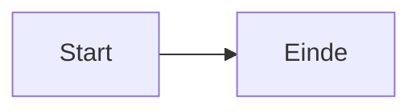

# MijnOverheid Zakelijk Site

In deze repository beheren we de website en content van [mijnoverheidzakelijk.nl](https://mijnoverheidzakelijk.nl).
De site wordt gegenereerd met [Hugo](https://gohugo.io/).

## Lokaal ontwikkelen

### Vereisten

Installeer Hugo, just en Node.js:

```bash
# macOS
brew install hugo just node
```

Of volg de installatie-instructies voor [Hugo](https://gohugo.io/installation/), [just](https://just.systems/man/en/) en [Node.js](https://nodejs.org/).

Installeer daarna de Node dependencies (eenmalig):

```bash
npm install
```

### Development server starten

```bash
just up
```

Dit rendert eerst de Mermaid-diagrammen als SVG en start daarna de Hugo development server. De site is dan beschikbaar op [http://localhost:1313/](http://localhost:1313/) (of de host zoals vermeld in de terminal).

Wil je dat diagrammen automatisch opnieuw worden gemaakt bij wijzigingen? Start dan in een aparte terminal:

```bash
just watch-mermaid
```

## Content toevoegen

### Weekly

Voeg een nieuwe weekly toe met:

```bash
hugo new content weekly/2026/2026-01-01.md
```

Of door een bestand in de juiste `content > weekly > jjjj` map te plaatsen.

### Presentatie

Presentaties gebruiken [Reveal.js](https://revealjs.com/) en wijken daarmee af van de overige pagina's.

Maak een nieuwe presentatie:

```bash
hugo new content presentaties/moza-pulse-x
```

#### Slide syntax

Elke slide is een `<section>` element:

```html
<section>
  <h2>Slide titel</h2>
  <p>Inhoud van de slide</p>
</section>
```

Geneste sections maken verticale slides (navigeer met pijltje omlaag). Zie [Reveal.js](https://revealjs.com/) voor meer informatie.

### Diagrammen

Gebruik een `mermaid` codeblock in Markdown voor diagrammen. Voeg altijd een `accTitle` en `accDescr` toe voor toegankelijkheid en als bestandsnaam voor de pre-gerenderde SVG:

````markdown

````

Diagrammen worden vooraf gerenderd als SVG (light + dark variant) door `scripts/render-mermaid.js`. De kleuren volgen automatisch het lichte of donkere thema via design tokens. Als de SVGs ontbreken, faalt de Hugo build met een foutmelding.

Render de SVGs opnieuw na het wijzigen van een diagram:

```bash
just render-mermaid
```

Zie [Mermaid](https://mermaid.js.org/) voor de volledige syntax.

## Code kwaliteit

We gebruiken [Lefthook](https://github.com/evilmartians/lefthook) voor pre-commit checks. Dit controleert automatisch of de site correct bouwt en of er geen broken links zijn.

### Installatie

```bash
# macOS
brew install lefthook htmltest

# Activeer hooks in dit project
lefthook install
```

### Handmatig uitvoeren

```bash
just pre-commit
```

Of direct met Lefthook:

```bash
lefthook run pre-commit
```

## Bouwen

### Lokaal bouwen

```bash
just build
```

Dit rendert eerst de Mermaid-diagrammen als SVG en bouwt daarna de site met Hugo.

De gegenereerde site staat in de `public/` directory.

### Container bouwen

Voor development (image wordt getagd met branch naam):

```bash
just cbuild   # Bouw container
just crun     # Start op localhost:8080
just cstop    # Stop container
just cclean   # Verwijder image en cache
```

Voor productie met specifieke baseURL:

```bash
podman build --build-arg BASE_URL=https://mijnoverheidzakelijk.nl -t moza-site .
podman run -p 8080:8080 moza-site
```

De site is dan beschikbaar op [http://localhost:8080/](http://localhost:8080/).

## Projectstructuur

```
.
├── archetypes/          # Archetype templates voor nieuwe content
├── assets/              # CSS, JavaScript en image bestanden (worden o.a. geminimaliseerd door Hugo)
├── content/             # Markdown en HTML content
│   ├── onderwerpen/     # Onderwerpen pagina's
│   ├── presentaties/    # Reveal.js presentaties
│   └── weekly/          # Weekly updates
├── layouts/             # Templates voor pagina's en componenten
│   ├── _partials/       # Herbruikbare template onderdelen
│   └── _shortcodes/     # Shortcodes, ofwel componenten, voor in content
├── scripts/             # Build scripts (Mermaid SVG rendering)
├── static/              # Statische bestanden (worden 1-op-1 gekopieerd)
├── .claude/             # Claude Code configuratie
├── .github/             # GitHub Actions workflows
├── hugo.yaml            # Hugo configuratie
├── justfile             # Command runner (just up, just build, etc.)
└── README.md            # Deze documentatie
```

## Credits

- Diagrammen: [Mermaid](https://mermaid.js.org/) (MIT licentie)
- Iconen: [Tabler Icons](https://tabler.io/icons) (MIT licentie)
- Zoeken: [Fuse.js](https://www.fusejs.io/) (Apache 2.0 licentie)
