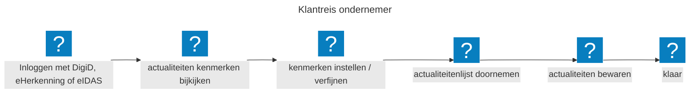

## Wat is de actualiteitenservice?

De actualiteitenservice stelt de ondernemer in staat om de voor hen relevante informatie te zien, vanuit verschillende overheidsbronnen. Enkele voorbeelden van de informatie zijn nieuwe wetten, subsidies of eventueel lokale ontwikkelingen. De actualiteitenservice is in staat om deze informatie te filteren op basis van verschillende kenmerken en daarmee zo relevant mogelijk te zijn.
De kenmerken waarop de filtering kan plaatvinden worden waar mogelijk voor ingevuld - maar de ondernemer is altijd in staat hier zelf keuzes in te maken. Tevens biedt de actualiteitenservice de mogelijkheid om pro-actief een signaal te ontvangen over nieuwe ontwikkelingen

## Waarom is dit nodig?

Vanuit de overheid wordt vanuit verschillende plekken informatie gedeeld, en daarmee is het voor de ondernemer lastig om het overzicht te behouden. Tevens is het lastig om te bepalen welke informatie relevant is; en heeft elke bron zijn eigen manier voor het delen van nieuwe informatie. Daarmee is de informatie versnipperd en is de kans groot dat relevante informatie wordt gemist.

De actualiteitenservice lost dit op:

- **Voor ondernemers:** je hebt één plek waar relevante informatie bij elkaar komt; en je hoeft dit maar op één plek bij te houden
- **Voor overheidsorganisaties:** de kans dat een ondernemer de relevante informatie leest wordt vergroot, door één centrale plek te bieden, en de mogelijkheid tot het ontvangen van een signaal bij nieuwe ontwikkelingen 
- **Voor de digitale overheid:** een herbruikbare bouwsteen die past binnen de [Generieke Digitale Infrastructuur (GDI)](https://www.digitaleoverheid.nl/mido/generieke-digitale-infrastructuur-gdi/).

## Wat kan de ondernemer?

