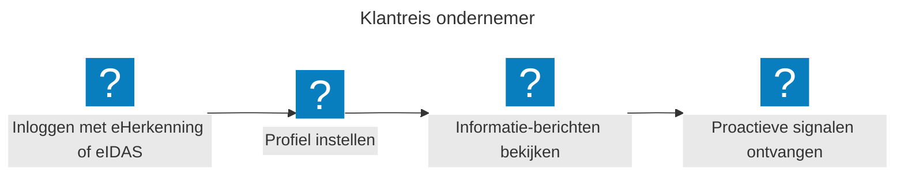
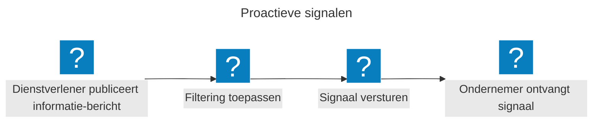
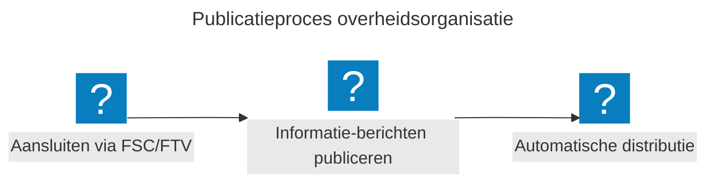

## Huidige uitdaging

Ondernemers krijgen overheidsinformatie op allerlei manieren en van verschillende kanten. Omdat er geen centrale plek is waar alles samenkomt, moeten ze zelf overal zoeken, inloggen en filteren. Daardoor missen ze soms belangrijke berichten, lopen ze subsidies mis of voldoen ze per ongeluk niet aan verplichtingen.

## Wat is de actualiteitenservice?

De actualiteitenservice laat ondernemers de informatie zien die voor hen relevant is. Die informatie komt uit verschillende overheidsbronnen. Denk aan nieuwe wetten, subsidies of lokale ontwikkelingen.

De service filtert die informatie op kenmerken als branche, locatie of bedrijfsgrootte. Waar het kan vullen we die kenmerken vooraf in, maar ondernemers passen ze altijd zelf aan. Wie dat wil, krijgt daarnaast automatisch een signaal bij nieuwe ontwikkelingen.

## De oplossing

Hieronder lichten we de belangrijkste uitgangspunten van de actualiteitenservice toe. We beschrijven ook hoe de service werkt voor ondernemers en voor overheidsorganisaties.

### Gegevens

De actualiteitenservice werkt met **informatie-berichten** en **filterkenmerken**. In de ideale opzet koppelt een dienstverlener elk informatie-bericht aan een of meer filterkenmerken. Zo komt een bericht alleen terecht bij de ondernemers voor wie het relevant is, in een inbox die daar speciaal voor bedoeld is.

* **Informatie-bericht**: de informatie die een overheidsorganisatie wil delen, zoals een nieuwe wet, subsidie of lokale ontwikkeling.

* **Filterkenmerken**: de kenmerken waarop de informatie gefilterd wordt, zoals branche, locatie, bedrijfsgrootte, onderwerp of urgentie.

### Informatie

Elk informatie-bericht wordt gekoppeld aan een of meerdere **filterkenmerken**. Deze kenmerken bepalen welke ondernemers het informatie-bericht te zien krijgen. Een informatie-bericht kan bijvoorbeeld gekoppeld zijn aan de branche *Horeca* en de locatie *Amsterdam*, zodat alleen horecaondernemers in Amsterdam het informatie-bericht ontvangen.

De actualiteitenservice toont daarmee alleen informatie-berichten die relevant zijn voor ondernemers en die hen helpen hun bedrijfsprocessen beter uit te voeren. Concreet gaat het om informatie zoals wet- en regelgeving, subsidies, lokale ontwikkelingen en urgente mededelingen.

### Hergebruik gegevens

Een informatie-bericht kan relevant zijn voor meerdere ondernemers. Daarom wordt elk informatie-bericht opgeslagen met de bijbehorende filterkenmerken, zodat het automatisch getoond kan worden aan alle relevante ondernemers. Dit zorgt voor efficiëntie en voorkomt dat dezelfde informatie meerdere keren gepubliceerd moet worden.

### Hoe werkt dit voor ondernemers?

Je logt in met eHerkenning of een Europees inlogmiddel (eIDAS), stelt je actualiteitenprofiel in met de relevante filterkenmerken en bekijkt de informatie-berichten die voor jou relevant zijn. Daarnaast ontvang je proactieve signalen over nieuwe ontwikkelingen.

### Filterkenmerken

De service filtert informatie op basis van bedrijfsspecifieke kenmerken. Hieronder een *illustratief* overzicht van de kenmerken waarop gefilterd kan worden:

| **Categorie**       | **Voorbeelden**                                                            | **Toelichting**                                           |
| ------------------- | -------------------------------------------------------------------------- | --------------------------------------------------------- |
| **Branche**         | Horeca, Bouw, Zorg, Retail, Landbouw, IT, Transport                        | Bepaalt welke sector-specifieke informatie getoond wordt. |
| **Locatie**         | Gemeente, Provincie, Landelijk, EU-wijd                                    | Filtert op regionale regelgeving en subsidies.            |
| **Bedrijfsgrootte** | ZZP, MKB (1-50), Middelgroot (50-250), Groot (250+)                        | Bepaalt welke regelgeving van toepassing is.              |
| **Onderwerpen**     | Subsidies, Wetgeving, Ruimtelijke ordening, Milieu, Financieel, Veiligheid | Stel in welke onderwerpen je wilt volgen.                 |
| **Urgentie**        | Laag, Medium, Hoog, Kritiek                                                | Filter op belangrijkheid van informatie-berichten.        |

### Proactieve signalen

Wanneer een nieuw informatie-bericht wordt gepubliceerd door een dienstverlener, past de actualiteitenservice filterkenmerken toe en verstuurt indien gewenst een signaal over deze informatie naar de relevante ondernemers. Gekoppeld aan de notificatiedienst kan de ondernemer een signaal via het gekozen kanaal, zoals e-mail of een melding in hun dashboard, ontvangen.

## Hoe werkt dit voor overheidsorganisaties?

Hieronder lees je hoe dit kan werken voor een overheidsorganisatie. Let op: in de proefopstelling die we gebouwd hebben, passen we nog niet al deze principes toe. Er zijn ook meerdere manieren om dit vorm te geven. Wat je hieronder ziet, is dus één van de mogelijke uitwerkingen.

### Publicatieproces

In dit geval publiceert een overheidsorganisatie informatie-berichten via de actualiteitenservice. De informatie-berichten worden automatisch gefilterd en getoond aan de relevante ondernemers.

Overheidsorganisaties sluiten eenmalig aan via Federatieve Service Connectiviteit (FSC) en Federatieve Toegangsverlening (FTV). Daarna publiceren zij hun informatie-berichten. Bij elk bericht geven ze de filterkenmerken mee in een vast formaat, zodat de service ze automatisch kan verwerken. De actualiteitenservice zorgt vervolgens voor de distributie naar de relevante ondernemers.

### Filterkenmerken

Elk informatie-bericht moet voorzien zijn van gestructureerde filterkenmerken voor optimale filtering. Hieronder een voorbeeld van verschillende kenmerken.

| **Filterkenmerk**   | **Voorbeeldwaarden**                      | **Verplicht?** | **Toelichting**                                       |
| ------------------- | ----------------------------------------- | -------------- | ----------------------------------------------------- |
| **Doelgroep**       | Horeca, Bouw, Zorg, MKB, Grote bedrijven  | Ja             | Bepaalt welke ondernemers het informatie-bericht zien. |
| **Regio**           | Landelijk, Noord-Holland, Amsterdam       | Ja             | Voor lokale of regionale informatie-berichten.         |
| **Onderwerp**       | Subsidie, Wetgeving, Ruimtelijke ordening | Ja             | Categorie van het informatie-bericht.                  |
| **Urgentie**        | Laag, Medium, Hoog, Kritiek               | Ja             | Bepaalt de prioriteit in de weergave.                  |
| **Geldigheid**      | Tijdelijk (datum), Permanent              | Nee            | Voor tijdgebonden informatie-berichten.                |
| **Contactgegevens** | E-mail, telefoonnummer, website           | Nee            | Voor vervolgvragen.                                    |

## Huidige status

We hebben de actualiteitenservice als concept getest bij gebruikers. Ook bouwden we een eerste testversie (een vroege alfaversie). Zo konden we nagaan of de ideeën technisch haalbaar zijn.

### Functioneel

In deze eerste testversie kan de actualiteitenservice het volgende:

1. Een ondernemer kan via een portaal zijn profiel instellen met de relevante filterkenmerken.

2. Informatie-berichten van overheidsorganisaties kunnen (automatisch) gefilterd worden (op basis van eerder ingegeven voorkeuren) en getoond worden aan de ondernemers.

### Technisch

Om die functies te bieden hebben we technisch het volgende ingeregeld:

* Centraal ophalen van informatie uit verschillende bronnen:

  * [de API van Ondernemersplein](https://ondernemersplein.overheid.nl/ondernemersplein-api/)

  * [wetten.overheid.nl](https://wetten.overheid.nl/)

  * [Berichten over uw buurt](https://www.overheid.nl/berichten-over-uw-buurt)

* Koppelen van informatie-berichten aan filterkenmerken

* Mogelijkheid tot het instellen van verschillende filterkenmerken, waaronder branche, locatie, bedrijfsgrootte, onderwerp en urgentie.

## Vervolgstappen

Uit [gebruikersonderzoek](/weekly/moza-weekly-20-mei-2026/#gebruikersonderzoek) blijkt dat de service ondernemers op dit moment te weinig oplevert. Ondernemers willen vooral informatie zien die echt over hun eigen situatie gaat. Dat kunnen we nu nog niet bieden.

Daar zijn twee redenen voor. De informatie uit de bronnen heeft nog niet de filterkenmerken die we voor dat filteren nodig hebben. En in de huidige vorm voegt die informatie te weinig toe voor ondernemers.

Daarom pauzeren we de verdere ontwikkeling van de actualiteitenservice.

## Meedoen

We hebben de actualiteitenservice gebouwd om ondernemers te helpen. Daarvoor hebben we nu nog niet de juiste bronnen. En de service heeft alleen waarde als meerdere overheidsorganisaties meedoen.

Heb je nieuwe inzichten op dit gebied? Neem dan contact met ons op. We nodigen je uit om mee te denken, mee te bouwen en kennis te delen: [praat met ons mee!](/contact/)

## Meer info

* [Voortgang en broncode op GitHub](https://github.com/MinBZK/moza-actualiteiten-service)

* Uitproberen in [het portaal MijnOverheid Zakelijk](https://moza.mijnoverheidzakelijk.nl/) als onderdeel van [de proeftuin](/onderwerpen/proeftuin/)
