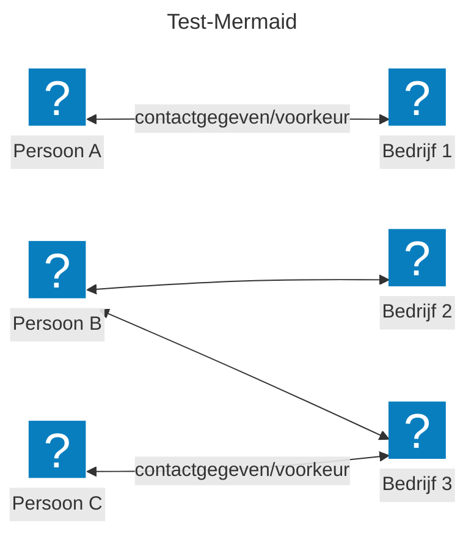

## Huidige uitdaging

Ondernemers ontvangen overheidsinformatie via meerdere kanalen (e-mail, mobiel, applicaties), vanuit verschillende bronnen (RVO, KVK, gemeenten, ministeries, brancheorganisaties, etc.) en in verschillende formaten (nieuwsbrieven, websites, pdf's, sociale media), alles zonder centrale regie. Dit leidt tot een slechte gebruikerservaring: je moet handmatig zoeken op meerdere sites, per bron apart inloggen en er is geen filtering op relevantie. Het resultaat is dat ondernemers belangrijke updates missen, waarmee subsidie-deadlines worden gemist en verplichtingen onbewust niet nagekomen worden.

## Wat is de Actualiteitenservice?

De actualiteitenservice stelt ondernemers in staat om de voor hen relevante informatie te zien, afkomstig uit verschillende overheidsbronnen. Denk aan nieuwe wetten, subsidies of lokale ontwikkelingen. De actualiteitenservice filtert deze informatie op basis van verschillende kenmerken, zoals branche, locatie of bedrijfsgrootte, en zorgt er zo voor dat de informatie zo relevant mogelijk is. De kenmerken waarop gefilterd wordt, worden waar mogelijk vooraf ingevuld, maar ondernemers kunnen deze altijd zelf aanpassen. Daarnaast biedt de actualiteitenservice de mogelijkheid om proactief een signaal te ontvangen over nieuwe ontwikkelingen.

## De oplossing

Hieronder lichten we de belangrijkste uitgangspunten van de actualiteitenservice toe en hoe deze werkt voor ondernemers en overheidsorganisaties.

### Gegevens

De actualiteitenservice werkt met **berichten** en **filterkenmerken**. In de ideale opzet koppelt een dienstverlener zijn bericht aan een of meerdere filterkenmerken, zodat het bericht alleen getoond wordt aan de relevante ondernemers.

* **Bericht**: de informatie die een overheidsorganisatie wil delen, zoals een nieuwe wet, subsidie of lokale ontwikkeling.

* **Filterkenmerken**: de kenmerken waarop het bericht gefilterd wordt, zoals branche, locatie, bedrijfsgrootte, onderwerp of urgentie.

### Informatie

Elk bericht wordt gekoppeld aan een of meerdere **filterkenmerken**. Deze kenmerken bepalen welke ondernemers het bericht te zien krijgen. Een bericht kan bijvoorbeeld gekoppeld zijn aan de branche *Horeca* en de locatie *Amsterdam*, zodat alleen horecaondernemers in Amsterdam het bericht ontvangen.

De actualiteitenservice toont daarmee alleen berichten die relevant zijn voor ondernemers en die hen helpen hun bedrijfsprocessen beter uit te voeren. Concreet gaat het om informatie zoals wet- en regelgeving, subsidies, lokale ontwikkelingen en urgente mededelingen.

### Hergebruik gegevens

Een bericht kan relevant zijn voor meerdere ondernemers. Daarom wordt elk bericht opgeslagen met de bijbehorende filterkenmerken, zodat het automatisch getoond kan worden aan alle relevante ondernemers. Dit zorgt voor efficiëntie en voorkomt dat dezelfde informatie meerdere keren gepubliceerd moet worden.

### Hoe werkt dit voor ondernemers?

Je logt in met eHerkenning of een Europees inlogmiddel (eIDAS), stelt je actualiteitenprofiel in met de relevante filterkenmerken en bekijkt de berichten die voor jou relevant zijn. Daarnaast ontvang je proactieve signalen over nieuwe ontwikkelingen.

***

### Filterkenmerken

De service filtert informatie op basis van bedrijfsspecifieke kenmerken. Hieronder een *illustratief* overzicht van de kenmerken waarop gefilterd kan worden:

| **Categorie**       | **Voorbeelden**                                                            | **Toelichting**                                           |
| ------------------- | -------------------------------------------------------------------------- | --------------------------------------------------------- |
| **Branche**         | Horeca, Bouw, Zorg, Retail, Landbouw, IT, Transport                        | Bepaalt welke sector-specifieke informatie getoond wordt. |
| **Locatie**         | Gemeente, Provincie, Landelijk, EU-wijd                                    | Filtert op regionale regelgeving en subsidies.            |
| **Bedrijfsgrootte** | ZZP, MKB (1-50), Middelgroot (50-250), Groot (250+)                        | Bepaalt welke regelgeving van toepassing is.              |
| **Onderwerpen**     | Subsidies, Wetgeving, Ruimtelijke ordening, Milieu, Financieel, Veiligheid | Stel in welke onderwerpen je wilt volgen.                 |
| **Urgentie**        | Laag, Medium, Hoog, Kritiek                                                | Filter op belangrijkheid van berichten.                   |

***

### Proactieve signalen

Wanneer een nieuw bericht wordt gepubliceerd door een dienstverlener, past de actualiteitenservice filterkenmerken toe en verstuurt indien gewenst een signaal naar de relevante ondernemers met over deze informatie. Gekoppeld aan de notificatiedienst kan de ondernemer een signaal via het gekozen kanaal, zoals e-mail of een melding in hun dashboard, ontvangen.

***

## Hoe kan dit werken overheidsorganisaties?

Hieronder wordt beschreven hoe dit dan zou kunnen werken vanuit een overheidsorganisatieperspectief. Let wel - in de proefopstelling die is gerealiseerd zijn niet al deze principe toegepast. Tevens zijn er ook meerder mogelijkheden om dit principe vorm te geven; hieronder is daarmee één van de uitwerkingen toegelicht.

### Publicatieproces

In dit geval publiceert een overheidsorganisatie berichten via de actualiteitenservice. De berichten worden automatisch gefilterd en getoond aan de relevante ondernemers.

Overheidsorganisaties sluiten eenmalig aan via Federatieve Service Connectiviteit (FSC) en Federatieve Toegangsverlening (FTV). Vervolgens publiceren zij berichten met gestructureerde metadata. De actualiteitenservice zorgt voor automatische distributie naar de relevante ondernemers.

***

### Filterkenmerken

Elk bericht moet voorzien zijn van gestructureerde filterkenmerken voor optimale filtering. Hieronder een voorbeeld van verschillende kenmerken

| Filterkenmerken     | **Voorbeeldwaarden**                      | **Verplicht?** | **Toelichting**                             |
| ------------------- | ----------------------------------------- | -------------- | ------------------------------------------- |
| **Doelgroep**       | Horeca, Bouw, Zorg, MKB, Grote bedrijven  | Ja             | Bepaalt welke ondernemers het bericht zien. |
| **Regio**           | Landelijk, Noord-Holland, Amsterdam       | Ja             | Voor lokale/regionale berichten.            |
| **Onderwerp**       | Subsidie, Wetgeving, Ruimtelijke ordening | Ja             | Categorie van het bericht.                  |
| **Urgentie**        | Laag, Medium, Hoog, Kritiek               | Ja             | Bepaalt prioriteit in weergave.             |
| **Geldigheid**      | Tijdelijk (datum), Permanent              | Nee            | Voor tijdgebonden berichten.                |
| **Contactgegevens** | E-mail, telefoonnummer, website           | Nee            | Voor follow-up vragen.                      |

## Huidige status

We hebben de actualiteitenservice als concept getest bij gebruikers, en tevens hebben wij een vroege alpha versie gerealiseerd. Dit om de eerste concepten ook technisch na te gaan; en te toetsen of deze ook daadwerkelijk gerealiseerd kunnen worden

### Functioneel

In huidige vroege alpha versie ondersteunt de actualiteitenservice de volgende functionele toepassingen:

1. Een ondernemer kan via een portaal zijn profiel instellen met de relevante filterkenmerken

2. Berichten van overheidsorganisaties kunnen (automatisch) gefilterd worden (op basis van eerder ingegeven voorkeuren) en getoond de ondernemers

### Technisch

Om de functionaliteiten te bieden zijn er vanuit de techniek de volgende zaken ingeregeld:

* Centraal ophalen van informatie vanuit verschillende bronnen

  * [Ondernemersplein API | Ondernemersplein](https://ondernemersplein.overheid.nl/ondernemersplein-api/)

  * wetten.overheid.nl

  * [Berichten over uw Buurt - Rondom een zelfgekozen adres](https://www.overheid.nl/berichten-over-uw-buurt)

* Koppelen van berichten aan filterkenmerken

* Mogelijkheid tot het instellen van verschillende filterkenmerken, waaronder branche, locatie, bedrijfsgrootte, onderwerp en urgentie.

## Vervolgstappen

Op basis van [gebruikersonderzoek](https://mijnoverheidzakelijk.nl/weekly/moza-weekly-20-mei-2026/?q=gebruikers#gebruikersonderzoek:~:text=aan%20de%20profielservice.-,Gebruikersonderzoek,-Twee%20onderzoeksdagen%3A) is er geconcludeerd dat de beschikbare informatie en de mogelijkheden die daarmee geboden worden niet de gewenste toegevoegde waarde bieden voor de ondernemers. Uit het onderzoek is gebleken dat het erg belangrijk is dat er primair relevante informatie getoond, iets dat op basis van de huidige mogelijkheden niet haalbaar is. Dit komt vooral uit het feit dat dat de informatie zelf (nog) niet voorzien is van de gewenste filterkenmerken, en uit het feit dat de informatie in de huidige vorm niet genoeg meerwaarde biedt.

Daarom is op dit moment op basis van de huidige inzichten ervoor gekozen om de verdere ontwikkeling op de actualiteitenservice te pauzeren.

## **Meedoen**

De actualiteitenservice is gebouwd we samen met mensen uit diverse organisaties en vakgebieden, van beleid en ontwerp tot juridisch en techniek. Want deze voorziening heeft alleen waarde als alle overheidsorganisaties meedoen. Mocht je nieuwe inzichten hebben op dit onderwerp - kom dan vooral met ons in contact. We nodigen je uit om mee te denken, mee te bouwen en kennis te delen, dus [praat met ons mee!](https://mijnoverheidzakelijk.nl/contact/)

## **Meer info**

* [Voortgang en broncode op GitHub](https://github.com/MinBZK/moza-actualiteiten-service)

* Uitproberen in [het portaal MijnOverheid Zakelijk](https://moza.mijnoverheidzakelijk.nl/) als onderdeel van [de proeftuin](https://mijnoverheidzakelijk.nl/onderwerpen/proeftuin/)
