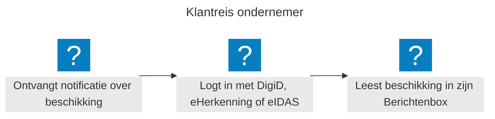
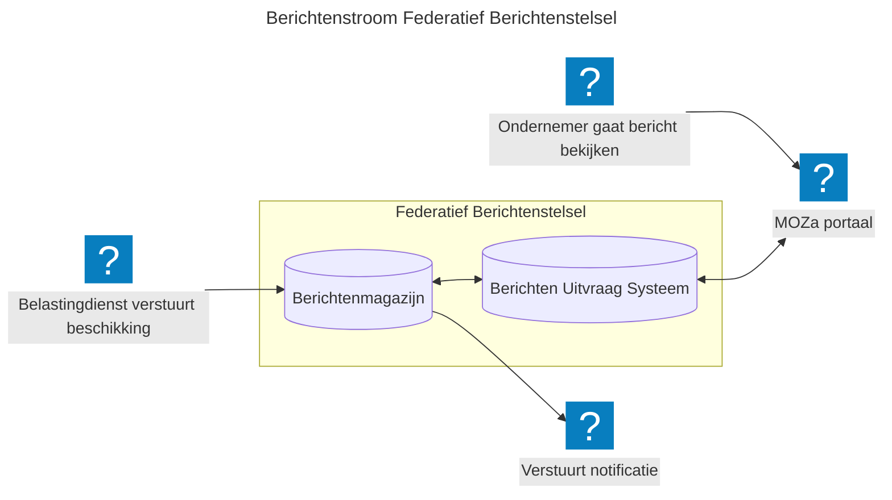

## Een Proof of Concept (PoC) van het federatieve berichtenstelsel
We werken aan een stelsel waarmee je berichten uit de berichtenmagazijnen van organisaties kan ophalen. In het federatieve stelsel werken overheidsorganisaties, centrale diensten en burgers en ondernemers samen via gestandaardiseerde koppelingen. Iedereen heeft een duidelijke rol:
- Verzenders: overheidsorganisaties die berichten versturen naar ondernemers of burgers.
- Stelsel: de centrale laag die verzenders en ontvangers met elkaar verbindt; zonder dat berichten centraal worden opgeslagen.​
- Ontvangers: ondernemers en burgers die berichten ontvangen en lezen via één centrale interface.

***"Er is géén centrale plek waar alle berichten worden opgeslagen. Elke (overheids)organisatie beheert zijn eigen berichten; het federatieve stelsel zorgt ervoor dat de burger of ondernemer ze altijd op de plek die op dat moment logisch is kan vinden".***

## Waarom is dit nodig?
Overheidsorganisaties communiceren nu elk op hun eigen manier met burgers en ondernemers. Dit leidt tot versnippering: berichten komen via verschillende kanalen binnen, zijn moeilijk terug te vinden en bieden geen eenduidig overzicht. Het Berichten/FBS lost dit op voor alle betrokken partijen:

* Burgers en ondernemers: de berichten kunnen uit de berichtenmagazijnen van organisaties opgehaald worden, op de plek daar waar het logisch is (een MijnOmgeving van de organisaties zijn, maar ook bijv. op het portaal MijnOverheid (Zakelijk), of de bedrijfssoftware van een onderneming, een eigen mobile app, etc.
* Overheidsorganisaties: versturen berichten vanuit het eigen berichtenmagazijn, of versturen berichten via een berichtenmagazijn dat door Logius wordt gehost (specifiek voor die organisatie).
* Digitale overheid: een herbruikbaar stelselcomponent binnen de Generieke Digitale Infrastructuur, gebouwd op open standaarden

## Hoe werkt het federatieve stelsel? Het verhaal van een beschikking van de Belastingdienst aan de ondernemer

## De PoC in meer details
Binnen het [MOZa PoC Federatief Berichtenstelsel](https://minbzk.github.io/moza-poc-fbs-berichtenbox/master/) zijn de volgende onderdelen in scope:
1. Aanlever API: waarmee instanties berichten aanmelden nadat zij die in hun eigen magazijn hebben geplaatst en versturen naar de burger of ondernemer
2. Validatie: elk bericht wordt gecontroleerd op technische eisen en toestemming van de ontvanger.​
3. Publiceren (Publicatie Stream): op de publicatiedatum meldt het berichtenmagazijn het bericht aan bij het Berichten Uitvraag Systeem (BUS).​
4. Ophaal- en Beheer API (vanuit BUS): waarmee berichten worden opgehaald en beheerd vanuit het perspectief van de ontvanger, zodat de burger of ondernemer deze kan lezen daar waar het logisch is (na ingelogd te zijn)
5. UI: een eenvoudige interface die laat zien hoe het stelsel er voor de gebruiker uitziet​​​.
6. Demo omgeving: een testomgeving voor het simuleren van verschillende situaties (nieuw bericht tonen tijdens inlog sessie van de ondernemer, uitvallende berichtenmagazijnen, te traag berichten ophalen, etc)
  
We verwachten na de zomer deze PoC afgerond te hebben. Het stelsel is gebouwd op open standaarden en open source principes: [MinBZK/moza-poc-fbs-berichtenbox: PoC voor de berichtenbox van het Federatief Berichtenstelsel](https://github.com/MinBZK/moza-poc-fbs-berichtenbox/)
Als vervolgstap willen we kleine pilots gaan starten zodat we de stelselafspraken in de praktijk kunnen gaan testen. 

## Doe mee en help ons met openstaande vraagstukken
Wil je als overheidsorganisatie aansluiten op het federatieve stelsel met een pilot, of bijdragen aan de doorontwikkeling hiervan? We werken samen op het gebied van beleid, design, juridische kaders en techniek.

Vraagstukken die open staan en waar we jouw input bij kunnen gebruiken:

- Hoe zorgen we ervoor dat berichten enkel worden getoond aan de personen die ook gemachtigd zijn om de berichten in te zien?
- Wat is er anders qua interactie tussen het berichtenmagazijn van de eigen organisatie versus het gemeenschappelijk berichtenmagazijn?
- Is een aparte 'Berichten' invalshoek wel de toekomst, aangezien berichten (en notificaties) vaak gekoppeld zijn aan een 'zaak'?
