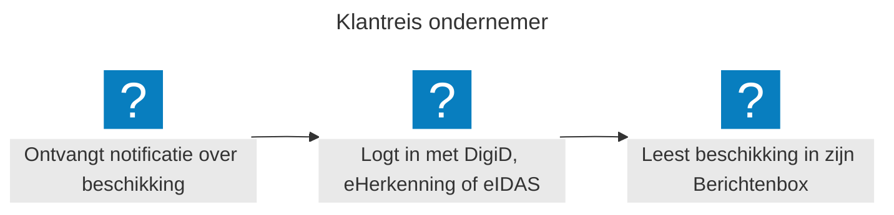
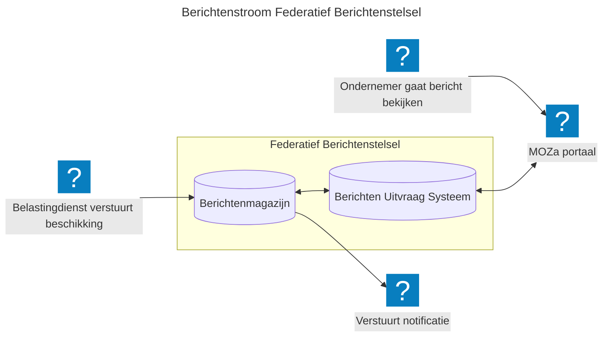

## Waar werken we aan?

We werken aan een Federatief Berichtenstelsel (FBS). Daarmee lees je als burger of ondernemer al je berichten van de overheid op de plek die voor jou logisch is. Dat kan het portaal van MijnOverheid Zakelijk zijn, maar ook de MijnOmgeving van een organisatie, je eigen bedrijfssoftware of een app.

## Waarom federatief?

Overheidsorganisaties communiceren nu elk op hun eigen manier. Berichten komen via verschillende kanalen binnen en zijn moeilijk terug te vinden. Je hebt geen overzicht.

Eén grote centrale berichtenbox lijkt dan een logische oplossing. Toch kiezen we daar bewust niet voor. In een federatief stelsel blijft elk bericht bij de organisatie die het verstuurt. Het stelsel zorgt er alleen voor dat je het kunt vinden en lezen.

***"Er is géén centrale plek waar alle berichten worden opgeslagen. Elke organisatie beheert haar eigen berichten. Het stelsel zorgt ervoor dat je ze vindt op de plek die voor jou logisch is."***

Dat levert veel op:

* **De bron blijft bij de eigenaar.** De organisatie die het bericht stuurt, blijft er verantwoordelijk voor. Er ontstaat geen centrale kopie van gevoelige gegevens.
* **Minder kwetsbaar.** Valt één berichtenmagazijn uit, dan werkt de rest gewoon door. Er is geen centraal punt dat alles plat kan leggen.
* **Lezen waar het logisch is.** Omdat berichten niet aan één portaal vastzitten, kun je ze op verschillende plekken tonen.
* **Organisaties houden de regie.** Een organisatie verstuurt berichten vanuit haar eigen berichtenmagazijn. Of ze gebruikt een magazijn dat Logius voor haar host.
* **Herbruikbaar voor de hele overheid.** Het stelsel is een bouwsteen binnen de [Generieke Digitale Infrastructuur (GDI)](https://www.digitaleoverheid.nl/mido/generieke-digitale-infrastructuur-gdi/), gebouwd op open standaarden.

In het stelsel heeft iedereen een duidelijke rol:

* **Verzenders:** overheidsorganisaties die berichten versturen naar burgers en ondernemers.
* **Het stelsel:** de laag die verzenders en ontvangers met elkaar verbindt, zonder berichten centraal op te slaan.
* **Ontvangers:** burgers en ondernemers die hun berichten lezen.

## Hoe werkt het? Een beschikking van de Belastingdienst

Neem een ondernemer die een beschikking krijgt van de Belastingdienst. De ondernemer krijgt een melding, logt in en leest de beschikking in de Berichtenbox.

```mermaid
---
title: Klantreis ondernemer
---
flowchart LR
  accTitle: Gebruikersreis ondernemer
  accDescr: De ondernemer ontvangt een notificatie over een beschikking, logt vervolgens in met DigiD, eHerkenning of eIDAS, en leest tot slot de beschikking in zijn Berichtenbox.
  A@{ icon: "nldd:bell", label: "Ontvangt notificatie over beschikking" }
  B@{ icon: "nldd:arrow-right-in-bucket", label: "Logt in met DigiD, eHerkenning of eIDAS" }
  C@{ icon: "nldd:file-text-badge-check-mark", label: "Leest beschikking in zijn Berichtenbox" }
  A --> B --> C
```

Achter de schermen blijft de beschikking in het berichtenmagazijn van de Belastingdienst. Het Berichten Uitvraag Systeem haalt het bericht op zodra de ondernemer het wil lezen.

```mermaid
---
title: Berichtenstroom Federatief Berichtenstelsel
---
flowchart LR
  accTitle: Berichtenstroom Federatief Berichtenstelsel
  accDescr: De Belastingdienst verstuurt een beschikking naar het Berichtenmagazijn. Het Berichtenmagazijn verstuurt een notificatie en wisselt gegevens uit met het Berichten Uitvraag Systeem. Het Berichten Uitvraag Systeem communiceert met het MOZa portaal, waar de ondernemer het bericht bekijkt.
  BD@{ icon: "nldd:apartment-building-2", label: "Belastingdienst verstuurt beschikking" }
  O@{ icon: "nldd:person", label: "Ondernemer gaat bericht bekijken" }
  MOZa@{ icon: "nldd:display", label: "MOZa portaal" }
  subgraph FBS["Federatief Berichtenstelsel"]
    direction LR
    BM[(Berichtenmagazijn)]
    BUS[(Berichten Uitvraag Systeem)]
  end
  N@{ icon: "nldd:bell", label: "Verstuurt notificatie" }
  BD --> BM
  O --> MOZa
  BM <--> BUS
  BUS <--> MOZa
  BM --> N
```

## Wat hebben we gedaan? De Proof of Concept

We bouwden een [Proof of Concept (PoC)](https://minbzk.github.io/moza-poc-fbs-berichtenbox/master/): een proefopstelling die laat zien dat een federatief berichtenstelsel werkt. De PoC bestaat uit deze onderdelen:

1. **Aanleveren:** organisaties melden een bericht aan nadat ze het in hun eigen magazijn hebben gezet.
2. **Controleren:** het stelsel controleert elk bericht op technische eisen en op toestemming van de ontvanger.
3. **Publiceren:** op de publicatiedatum meldt het magazijn het bericht aan bij het Berichten Uitvraag Systeem.
4. **Ophalen en beheren:** na het inloggen haalt de ontvanger zijn berichten op, waar hij ze ook wil lezen.
5. **Berichtenbox:** een eenvoudige schermweergave die laat zien hoe het stelsel er voor de gebruiker uitziet.
6. **Demo-omgeving:** hier bootsen we lastige situaties na, zoals honderd magazijnen tegelijk, een magazijn dat uitvalt of berichten die traag binnenkomen.

De onderdelen praten veilig met elkaar via [Federated Service Connectivity (FSC)](https://fsc-standaard.nl/hoe-werkt-fsc/). Dat is een standaard voor het federatief koppelen van diensten.

De PoC is inmiddels gekoppeld aan onze [proeftuin](/onderwerpen/proeftuin/). De Berichtenbox in de proeftuin toont dus geen vaste voorbeelden meer, maar berichten die echt uit het stelsel komen.

Alles is open source. Je vindt de code op GitHub: [MinBZK/moza-poc-fbs-berichtenbox](https://github.com/MinBZK/moza-poc-fbs-berichtenbox/).

## Wat gaan we doen? Een pilot met afnemers

Eind dit jaar starten we met een pilot. Samen met overheidsorganisaties die berichten versturen, de afnemers, testen we het stelsel in de praktijk. Dat doen we samen met Logius in de werkgroep Berichten, onder het programma OBIS.

In de pilot doen we twee dingen:

1. **Onze PoC testen.** We beproeven met de afnemers of de werking van de PoC standhoudt in de praktijk. Werken de afspraken in het stelsel? En wat is er nodig om aan te sluiten?
2. **Route 2 verkennen: FSC voor burgers.** Deze route is geïnspireerd op het [Vorderingenoverzicht Rijk](https://vorijk.nl/docs/introductie/). Dat stelsel is gemaakt voor burgers. Met dezelfde afnemers verkennen we of het ook werkt voor ondernemers.

Van begin af aan werken beleid, ontwerp, juridische zaken en techniek samen in de pilot.

## Doe mee

Wil je als overheidsorganisatie meedoen aan de pilot? Of wil je meedenken over de doorontwikkeling van het stelsel? [Neem contact met ons op](/contact/).

Bij deze vragen kunnen we jouw input goed gebruiken:

* Hoe zorgen we ervoor dat alleen mensen die daartoe gemachtigd zijn een bericht te zien krijgen?
* Wat is het verschil in werking tussen een eigen berichtenmagazijn en een gezamenlijk magazijn?
* Is een aparte plek voor berichten wel de toekomst? Berichten en notificaties horen vaak bij een zaak. Misschien moeten berichten, zaken en taken via hetzelfde mechanisme lopen.
