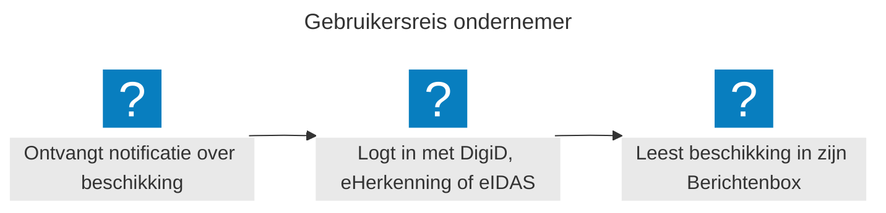
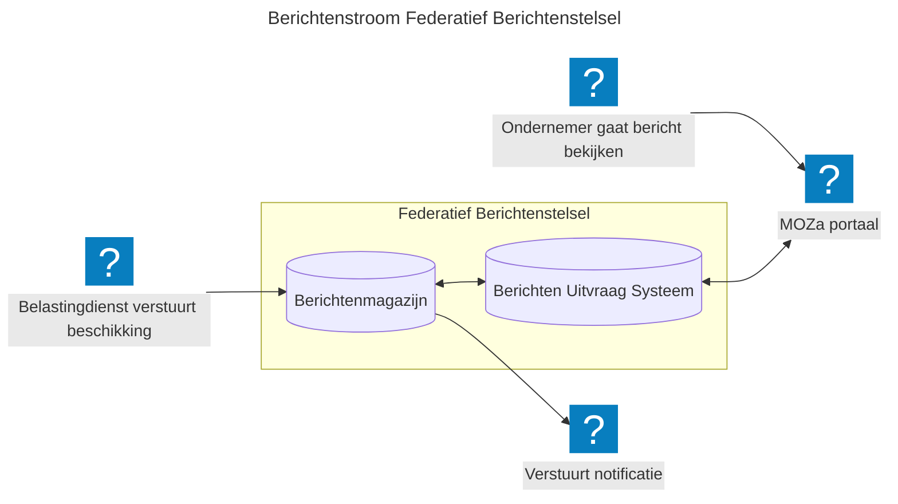

## Wat is de Berichtenbox?
De Berichtenbox is de digitale brievenbus waar ondernemers berichten van overheidsorganisaties ontvangen. Het is onderdeel van het Federatief Berichten Stelsel (FBS). Dit is een stelsel van federatief gekoppelde diensten voor het versturen van berichten van overheidsorganisaties naar burgers en ondernemers. Het FBS vervangt het huidige GLOBE-systeem en is ontworpen als toekomstbestendige, open infrastructuur.

## Waarom is dit nodig?
Overheidsorganisaties communiceren nu elk op hun eigen manier met ondernemers. Dit leidt tot versnippering: berichten komen via verschillende kanalen binnen, zijn moeilijk terug te vinden en bieden geen eenduidig overzicht. Het FBS lost dit op voor drie partijen:

* Ondernemers: één digitale brievenbus voor alle overheidscommunicatie, toegankelijk via MijnOverheid Zakelijk
* Overheidsorganisaties: versturen berichten vanuit het eigen berichtenmagazijn, of versturen berichten via een gemeenschappelijk berichtenmagazijn (BBO), als zij zelf geen berichtenmagazijn hebben of willen.
* Digitale overheid: een herbruikbaar stelselcomponent binnen de Generieke Digitale Infrastructuur, gebouwd op open standaarden

## Wat kan de ondernemer?
De ondernemer logt in via eHerkenning of DigiD en ziet in één overzicht alle berichten van aangesloten overheidsorganisaties. Berichten zijn afkomstig van organisaties die elk hun eigen berichtenmagazijn beheren; de ondernemer merkt daar niets van. Via de Profielservice beheert de ondernemer zijn contactgegevens en communicatievoorkeuren. Zo bepaalt hij zelf hoe en waar hij genotificeerd wil worden bij een nieuw bericht: per e-mail, sms of via een app.

## Wat kunnen overheidsorganisaties?
Overheidsorganisaties plaatsen berichten in hun eigen berichtenmagazijn. Ze melden vervolgens het bericht aan bij het Berichten Uitvraag Systeem (via Aanlever API). Dit stelsel zorgt er vervolgens voor dat de juiste ontvanger het bericht te zien krijgt. Organisaties zonder eigen berichtenmagazijn kunnen gebruik maken van het BBO; het gemeenschappelijk Berichtenmagazijn voor Burgers en Ondernemers.

## Hoe werkt de Berichtenbox? Het verhaal van een beschikking
In dit overzicht neemt de Belastingdienst een gemeenschappelijk Berichtenmagazijn af, omdat zij zelf géén eigen Berichtenmagazijn hebben.

***"Het federatieve principe in één zin: er is geen centrale plek waar alle berichten worden opgeslagen. Elke organisatie beheert zijn eigen berichten; het stelsel zorgt ervoor dat de ondernemer ze altijd op één plek kan vinden".***
1. Aanlevering gebeurt via de Berichtenmagazijn Aanlever API. Deze API stuurt berichten ter\
   validatie op technische eisen en controleert toestemming via Profiel Service.

2. Als publicatiedatum is verstreken, wordt een seintje gegeven aan het 'Berichten Uitvraag Systeem'. Ook wordt via de Publicatie Stream de ondernemer genotificeerd (communicatie-en kanaalvoorkeur wordt opgehaald uit de Profielservice en Notificatie service.

3. De ondernemer logt in op het portal Mijn Overheid Zakelijk en gebruikt daarvoor DigiD of\
   E-Herkenning.

4. Het MOZa-portaal haalt het bericht (incl bijlagen) op via de Berichtenmagazijn Ophaal- en Beheer API. Deze API toetst ook de ophaal- en beheerverzoeken aan het autorisatiebeleid van de deelnemende organisaties.

5. De ondernemer leest het bericht; in dit geval de beschikking die hij heeft ontvangen van\
   de Belastingdienst.

6. Tijdens de sessie van de ondernemer in het MOZa portaal, wordt continu bijgehouden\
   of er nieuwe berichten beschikbaar komen voor de ondernemer. Deze berichten worden dan direct getoond (via flow stap 2).

## Hoe bouwen we dit?
Het FBS wordt gefaseerd gerealiseerd:

1. BBO-integratie; organisaties zonder eigen magazijn kunnen gebruik maken van het gemeenschappelijk BBO
2. Aansluiting eerste organisaties; pilotorganisaties sluiten aan met hun eigen berichtenmagazijn en testen de stelselafspraken
3. Uitrol en opschaling; bredere aansluiting van overheidsorganisaties, met doorontwikkeling van notificatie en machtigingen

Het stelsel is gebouwd op open standaarden en open source principes.

## Doe mee en help ons met openstaande vraagstukken
Wil je als overheidsorganisatie aansluiten op de Berichtenbox, of bijdragen aan de doorontwikkeling van het stelsel? We werken samen op het gebied van beleid, design, juridische kaders en techniek.

Vraagstukken die open staan en waar we jouw input bij kunnen gebruiken:

* Hoe zorgen we ervoor dat berichten enkel worden getoond aan de personen die ook gemachtigd zijn om de berichten in te zien?
* Wat gaat er anders zijn qua interactie tussen het berichtenmagazijn van de eigen organisatie versus het gemeenschappelijk berichtenmagazijn?
* ...

## Meer info
* Meer achtergrondinformatie vanuit Logius: <https://www.logius.nl/onze-dienstverlening/interactie/federatief-berichten-stelsel>
* C4-diagram: [MOZa PoC Federatief Berichtenstelsel](https://minbzk.github.io/moza-poc-fbs-berichtenbox/master/)
* Open Source PoC project: [MinBZK/moza-poc-fbs-berichtenbox: PoC voor de berichtenbox van het Federatief Berichtenstelsel](https://github.com/MinBZK/moza-poc-fbs-berichtenbox/)
