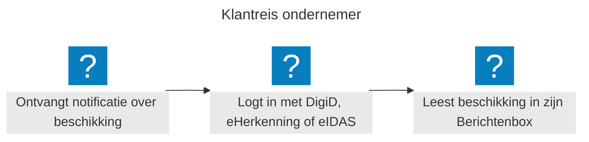
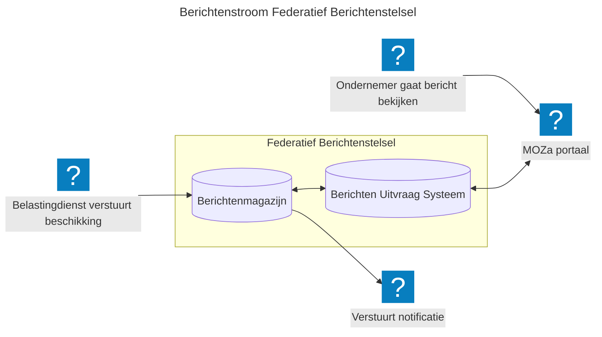

## Wat is het federatieve berichtenstelsel?
De Berichtenbox is de digitale brievenbus waar ondernemers berichten van overheidsorganisaties ontvangen. Het is onderdeel van het Federatief Berichten Stelsel (FBS). Dit is een stelsel van federatief gekoppelde diensten voor het versturen van berichten van overheidsorganisaties naar burgers en ondernemers. Het FBS vervangt het huidige GLOBE-systeem en ook de berichtenbox van RVO en is ontworpen als toekomstbestendige, open infrastructuur.

## Waarom is dit nodig?
Overheidsorganisaties communiceren nu elk op hun eigen manier met ondernemers. Dit leidt tot versnippering: berichten komen via verschillende kanalen binnen, zijn moeilijk terug te vinden en bieden geen eenduidig overzicht. Het FBS lost dit op voor drie partijen:

* Ondernemers: één digitale brievenbus voor alle overheidscommunicatie, o.a. toegankelijk via MijnOverheid Zakelijk
* Overheidsorganisaties: versturen berichten vanuit het eigen berichtenmagazijn, of versturen berichten via een berichtenmagazijn dat door Logius wordt gehost (specifiek voor die organisatie).
* Digitale overheid: een herbruikbaar stelselcomponent binnen de Generieke Digitale Infrastructuur, gebouwd op open standaarden

## Wat kan de ondernemer?
De ondernemer logt in via eHerkenning, DigiD of eIDAS (later in de toekomst via een 'wallet') en ziet in één overzicht alle berichten van de aangesloten overheidsorganisaties. Berichten zijn afkomstig van organisaties die elk hun eigen berichtenmagazijn beheren; de ondernemer merkt daar niets van. Via de Profielservice beheert de ondernemer zijn contactgegevens en communicatievoorkeuren. Zo bepaalt hij zelf hoe en waar hij genotificeerd wil worden bij een nieuw bericht: per e-mail, sms of via een app.

## Wat kunnen overheidsorganisaties?
Overheidsorganisaties plaatsen berichten in hun eigen berichtenmagazijn. Ze melden vervolgens het bericht aan bij het Berichten Uitvraag Systeem (via de Aanlever API). Dit stelsel zorgt er vervolgens voor dat de juiste ontvanger het bericht te zien krijgt. Organisaties zonder eigen berichtenmagazijn kunnen gebruik maken van een berichtenmagazijn dat door Logius wordt gehost.

## Hoe werkt de Berichtenbox? Het verhaal van een beschikking van de Belastingdienst

***"Het federatieve principe in één zin: er is geen centrale plek waar alle berichten worden opgeslagen. Elke organisatie beheert zijn eigen berichten; het stelsel zorgt ervoor dat de ondernemer ze altijd op één plek kan vinden".***

## Hoe bouwen we dit? We starten met een proof-of-concept
Op dit moment werken we hard aan een proof-of-concept (POC) om de werking van het federatieve stelsel te verkennen en aan te tonen. We bouwen o.a. een Aanlever API (deze API stuurt berichten ter validatie op technische eisen en controleert toestemming via de Profiel Service) en een Ophaal- en Beheer API (deze API toetst de ophaal- en beheerverzoeken aan het autorisatiebeleid van de deelnemende organisaties). Verder gaan we in de POC óók een demo omgeving bouwen. Via deze demo omgeving willen we verschillende situaties simuleren (o.a. wel of geen toestemming, nieuw bericht tonen tijdens inlog sessie van de ondernemer, te traag berichten ophalen, uitvallende berichtenmagazijnen, etc). We verwachten na de zomer deze POC afgerond te hebben. Als vervolgstap willen we kleine pilots gaan starten zodat we de stelselafspraken kunnen gaan testen. 

We werken aan een stelsel waarmee je berichten uit de berichtenmagazijnen van organisaties kan ophalen. Dit kan op een MijnOmgeving van de organisaties zijn, maar ook bijv. op portaal MijnOverheid (Zakelijk) waarbij alle berichtenmagazijnen worden uitgelezen. Of de bedrijfssoftware van een onderneming, een eigen mobile app, etc.

Het stelsel is gebouwd op open standaarden en open source principes.

## Doe mee en help ons met openstaande vraagstukken
Wil je als overheidsorganisatie aansluiten op de Berichtenbox, of bijdragen aan de doorontwikkeling van het stelsel? We werken samen op het gebied van beleid, design, juridische kaders en techniek.

Vraagstukken die open staan en waar we jouw input bij kunnen gebruiken:

* Hoe zorgen we ervoor dat berichten enkel worden getoond aan de personen die ook gemachtigd zijn om de berichten in te zien?
* Wat is er anders qua interactie tussen het berichtenmagazijn van de eigen organisatie versus het gemeenschappelijk berichtenmagazijn?
* Is een aparte Berichtenbox wel de toekomst, aangezien berichten (en notificaties) vaak gekoppeld zijn aan een 'zaak'?
  
## Meer info
* Meer achtergrondinformatie vanuit Logius: <https://www.logius.nl/onze-dienstverlening/interactie/federatief-berichten-stelsel>
* C4-diagram: [MOZa PoC Federatief Berichtenstelsel](https://minbzk.github.io/moza-poc-fbs-berichtenbox/master/)
* Open Source PoC project: [MinBZK/moza-poc-fbs-berichtenbox: PoC voor de berichtenbox van het Federatief Berichtenstelsel](https://github.com/MinBZK/moza-poc-fbs-berichtenbox/)
