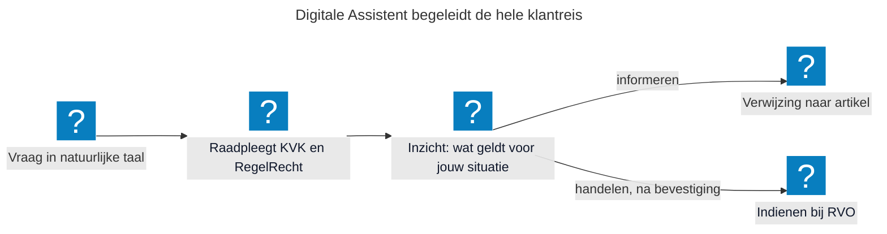
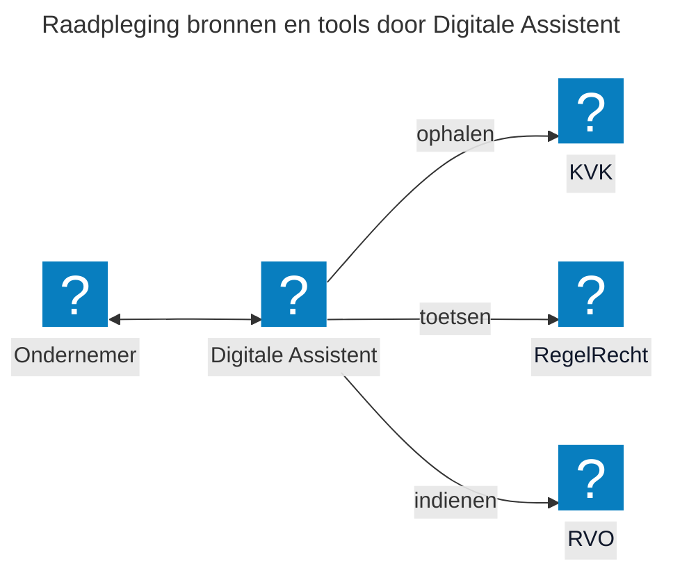

## De Digitale Assistent als Proof of Concept

In de periode januari tot en met april 2026 is een proof-of-concept (POC) ontwikkeld waarin is onderzocht hoe de Model Context Protocol (MCP) AI-hosts, zoals vlam-chat of in de toekomst wellicht GPT-NL, verbindt met machine-uitvoerbare wetgeving via RegelRecht. [Regelrecht](https://regelrecht.rijks.app/) maakt wetgeving uitvoerbaar als code en bijbehorende uitrekenmachine zodat de wet uitgerekend kan worden.  MCP is het protocol waarmee AI-systemen deze machines/engines aanroepen, zodat ondernemers via AI-interactie regels toepassen op de eigen situatie om zaken te doen met de overheid.

De POC werkt op dit moment voor één casus: de informatieplicht energiebesparing. De KVK draait op de testomgeving, RVO is gesimuleerd en de assistent is nog niet aangesloten op een productieomgeving. De volgende stap is meer wetten op te nemen in Regelrecht, zodat we meerdere casussen kunnen doorlopen. Om de ondernemer een uniforme ervaring te kunnen bieden, is het van belang dat zowel de uitvoering als de informatievoorziening op dezelfde bron is gebaseerd.

**"De ondernemer stelt een vraag in gewone taal, de assistent kiest zelf welke bron nodig is en laat bij elk antwoord zien waar het vandaan komt".**

## Wat kan de ondernemer (in deze PoC)?

De vraag "moet mijn bedrijf voldoen aan de informatieplicht energiebesparing?" wordt in één flow direct afgehandeld. De Digitale Assistent haalt eerst de bedrijfsgegevens op bij de KVK. Vervolgens controleert De Digitale Assistent via RegelRecht of de regel op deze onderneming van toepassing is en of er nog data ontbreekt. De Digitale Assistent verwijst naar het juiste artikel en biedt de ondernemer aan om de rapportage direct bij RVO in te dienen. Eén vraag, één userflow, in plaats van vier websites. Uiteraard in een afgebakende omgeving met de juiste richtlijnen. Van informatievoorziening kan de ondernemer direct overgaan tot het uitvoeren van de actie.

## Wat kunnen overheidsorganisaties?

De opzet is open source en modulair. Iedere bron is een losse aansluiting. Een organisatie die haar eigen regelhulp, register of regeling aan MOZa wil koppelen, hoeft de assistent niet opnieuw te bouwen, alleen de eigen bron toe te voegen inclusief interactie instructies. Dat past bij de gedachte van MOZa: gezamenlijke services in plaats van ieder zijn eigen portaal.

Daarnaast rekenen alle kanalen met dezelfde regel. Wat de Digitale Assistent zegt, is precies wat RegelRecht elders ook rekent en wat een formulier of medewerker zou moeten antwoorden. Bij een wijziging in de regelgeving wordt die wijziging op één plek doorgevoerd en werkt die door in de hele keten. Bij elk antwoord wordt de herkomst vastgelegd: welke bron, welk artikel, welk moment, welke input etc. Dat is bruikbaar voor verantwoording en traceerbaarheid.

## Hoe gaan we nu verder?

**Validatie**

De POC werkt met wetten die zijn omgezet naar Regelrecht. De vraag die de demo's van de POC hebben opgeleverd is of die omzetting inhoudelijk klopt: *weerspiegelen de machine-uitvoerbare wetten daadwerkelijk wat de wet bedoelt en hoe uitvoeringsorganisaties die in de praktijk toepassen?* Zonder deze validatie is de betrouwbaarheid van de gehele keten onzeker. Als de machine-uitvoerbare wetten niet kloppen, kloppen de antwoorden aan de ondernemer ook niet. Dit raakt direct aan het vertrouwen in de standaard en aan de bruikbaarheid voor eventuele opschaling.

**Ondernemer centraal**

Daarnaast heeft de POC zich overwegend op de technische werking gefocused, maar of de interactie ook klopt vanuit het perspectief van de ondernemer is nog niet onderzocht. Daarom willen we in de aankomende periode een representatieve user flow uitwerken en toetsen met een kleine groep ondernemers: begrijpen zij wat er gebeurt, vertrouwen zij de uitkomst, en weten zij wat zij ermee moeten doen? Want we moeten ondernemers helpen en we weten nu niet zeker hoe de integratie van deze technologie daar het beste aan bijdraagt. Gebruikersonderzoek voorkomt dat aannames over gebruikersbegrip en vertrouwen ongetoetst blijven tot het te laat is om bij te sturen.

## Doe mee en help ons met openstaande vraagstukken

Wil je als overheidsorganisatie aansluiten op de Digitale Assistent, of bijdragen aan de doorontwikkeling van Regelrecht en de Digitale Assistent? We werken samen op het gebied van beleid, design, juridische kaders en techniek.

Vraagstukken die open staan en waar we jouw input bij kunnen gebruiken:

* Hoe zorgen we dat Regelrecht niet alleen een bron van documenten is met bijbehorende uitrekenmachine voor de Digitale Assistent, maar ook de standaard uitvoering voert?

## Meer info

- [Regelrecht](https://regelrecht.rijks.app/)

- [Van MCP naar CLI?](https://github.com/MinBZK/moza-poc/blob/feat/add_digitale_assistent/services/decisions/PDR-005-cli-vs-mcp-transport.md)

