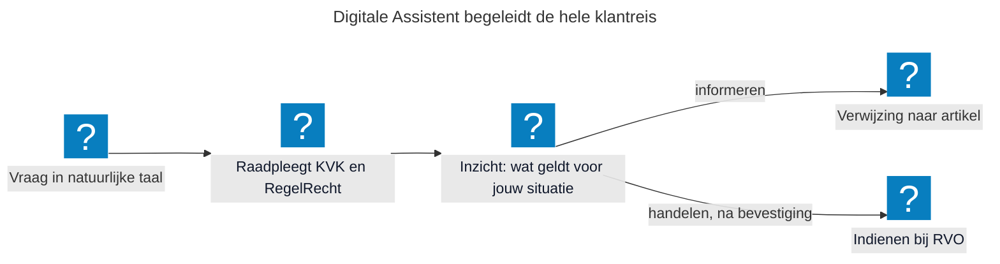
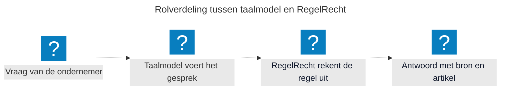
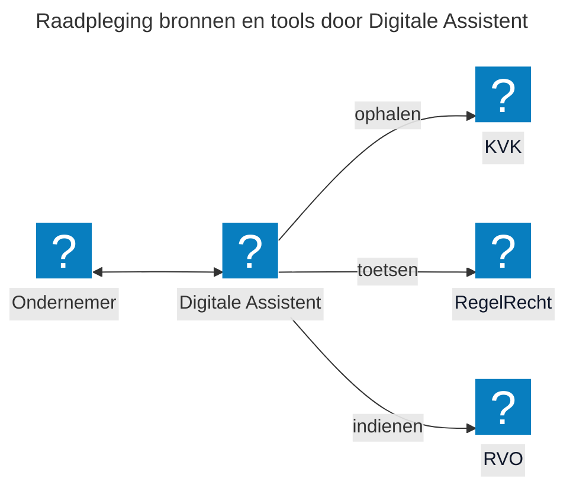

## De Digitale Assistent als Proof of Concept

In de periode januari tot en met april 2026 is een proof of concept (POC) ontwikkeld waarin is onderzocht hoe het Model Context Protocol (MCP) AI-hosts, zoals vlam-chat of in de toekomst wellicht GPT-NL, verbindt met machine-uitvoerbare wetgeving via RegelRecht. [RegelRecht](https://regelrecht.rijks.app/) maakt wetgeving uitvoerbaar als code en bijbehorende uitrekenmachine zodat de wet uitgerekend kan worden. MCP is het protocol waarmee AI-systemen deze machines/engines aanroepen, zodat ondernemers via AI-interactie regels toepassen op de eigen situatie om zaken te doen met de overheid. Om de ondernemer een uniforme ervaring te kunnen bieden, is het van belang dat zowel de uitvoering als de informatievoorziening op dezelfde bron is gebaseerd.

**"De ondernemer stelt een vraag in gewone taal, de assistent kiest zelf welke bron nodig is en laat bij elk antwoord zien waar het vandaan komt".**

> [!INFO]
> De POC werkt op dit moment voor één casus: de informatieplicht energiebesparing. De KVK draait op de testomgeving, RVO is gesimuleerd en de assistent is nog niet aangesloten op een productieomgeving. Opschalen naar meer wetten en meer uitvoeringsorganisaties is de volgende stap.

## Wat kan de ondernemer (in deze POC)?

De vraag "moet mijn bedrijf voldoen aan de informatieplicht energiebesparing?" wordt in één flow direct afgehandeld. De Digitale Assistent haalt eerst de bedrijfsgegevens op bij de KVK. Vervolgens controleert De Digitale Assistent via RegelRecht of de regel op deze onderneming van toepassing is en of er nog data ontbreekt. De Digitale Assistent verwijst naar het juiste artikel en biedt de ondernemer aan om de rapportage direct bij RVO in te dienen. Eén vraag, één userflow, in plaats van vier websites. Uiteraard in een afgebakende omgeving met de juiste richtlijnen. Van informatievoorziening kan de ondernemer direct overgaan tot het uitvoeren van de actie.

Bij demonstraties van de Digitale Assistent komen steeds dezelfde vragen terug. Welk probleem lost dit op? Waarom zetten we generatieve AI in? Waarom gebruiken we RegelRecht? En waarom deze technische opzet? Hieronder beantwoorden we die vragen, inclusief de nadelen.

## Welk probleem lost dit op?

Een ondernemer die wil weten of een verplichting voor zijn bedrijf geldt, zoekt dat nu zelf uit. Welke regel geldt, welke organisatie gaat erover, welke gegevens zijn nodig en welk formulier hoort erbij? Die stappen zijn verdeeld over verschillende websites en organisaties, terwijl het voor de ondernemer één vraag is. Dit resulteert in regeldruk. Om diensten te verlenen, daar waar het voor de ondernemer logisch is, brengt de Digitale Assistent die stappen samen in één gesprek, van de vraag tot het indienen van de rapportage. Daarmee bereiken we:

* **Voor ondernemers:** één vraag in gewone taal, in plaats van zelf uitzoeken welke regel geldt en welke organisatie erover gaat. De uitleg gaat over de eigen situatie en de ondernemer kan direct overgaan tot handelen.
* **Voor overheidsorganisaties:** de informatievoorziening en de uitvoering rekenen met dezelfde regel. Wat de assistent zegt, is wat elders ook wordt uitgerekend en wat een formulier of medewerker zou moeten antwoorden.
* **Voor de digitale overheid:** een modulaire, open source opzet waarin elke bron een losse aansluiting is. Een organisatie die haar eigen regelhulp, register of regeling wil koppelen, hoeft de assistent niet opnieuw te bouwen, alleen de eigen bron toe te voegen met de bijbehorende interactie-instructies. Dat past bij de gedachte van MOZa: gezamenlijke services in plaats van ieder zijn eigen portaal.

Bij elk antwoord leggen we de herkomst vast: welke bron is geraadpleegd, welk artikel van toepassing is, op welk moment en met welke gegevens. De ondernemer leest daarmee na waar het antwoord op steunt, en wij verantwoorden achteraf hoe de uitkomst tot stand kwam. Bij een wijziging in de regelgeving wordt die op één plek doorgevoerd en werkt die door in de hele keten.

## Waarom zetten we generatieve AI in?

De overheid heeft al hulpmiddelen die een ondernemer door een regeling heen leiden: regelhulpen, wizards en beslisbomen. Die werken goed voor één regeling, maar ze moeten per regeling gebouwd en onderhouden worden. Bovendien moet de ondernemer weten dát de regeling bestaat, waar de hulp staat en welke vraag hij moet stellen.

Generatieve AI lost een ander deel van het probleem op. Een taalmodel begrijpt een vraag in gewone taal, zoals die aan een adviseur gesteld zou worden. Daarmee vindt het de juiste bronnen bij een vraag, ook als de ondernemer de naam van de regeling niet kent en niet weet welke organisatie erover gaat. Daarnaast combineert het meerdere bronnen in één gesprek: eerst de bedrijfsgegevens bij de KVK, dan de toets bij RegelRecht, dan het indienen bij RVO.

Generatieve AI doet in deze opzet dus twee dingen: de vraag begrijpen en de bronnen in de juiste volgorde aanroepen. Het rekenwerk, het besluit en de gegevens komen ergens anders vandaan.

Die vorm heeft duidelijke voordelen, en net zo duidelijke nadelen:

* **Voordelen:** de ondernemer krijgt uitleg over de eigen situatie en kan doorvragen. Het blijft bovendien niet bij informeren: de assistent vult het formulier alvast in met de gegevens die al bekend zijn en dient het na bevestiging in bij RVO.
* **Nadelen:** een taalmodel verzint antwoorden, formuleert dezelfde vraag steeds anders en klinkt overtuigend genoeg om niet gecontroleerd te worden. Een gesprek laat bovendien minder zien waar een antwoord op rust dan een formulier of een besluit. En niet elke ondernemer wil chatten.

Die nadelen bepalen de opzet. Bij elk antwoord toont de assistent de bron en het artikel, handelen gebeurt pas na een expliciete bevestiging en de assistent werkt in een afgebakende omgeving met vaste bronnen en instructies. En het taalmodel rekent niet.

### We willen niet nog een chatvenster erbij

In de POC voeren we het gesprek in een chatvenster, maar dat is de vorm van nu en niet het eindbeeld. Los van de bestaande kanalen lost een chatvenster weinig op: er komt een kanaal bij, terwijl er juist stappen moeten verdwijnen. Zet elke organisatie er zelf een neer, dan ontstaat er versnippering.

We werken daarom toe naar assistentie die in de dienstverlening zelf zit. In het prototype proberen we dat uit met een notificatie, een formulier in het gesprek en een zaakdossier dat ontstaat zodra de rapportage is ingediend. Omdat de bronnen via MCP zijn ontsloten, kan die hulp net zo goed landen in het portaal, in een bestaande regelhulp of in de bedrijfssoftware die de ondernemer al gebruikt. Welke vorm past, is een ontwerpvraag die we samen met ondernemers beantwoorden.

## Waarom gebruiken we RegelRecht?

[RegelRecht](https://regelrecht.rijks.app/) maakt wetgeving uitvoerbaar als code, met een bijbehorende uitrekenmachine. Daarmee ondervangen we het grootste risico van generatieve AI bij de overheid: het taalmodel interpreteert de wet niet. Het taalmodel begrijpt de vraag van de ondernemer en voert het gesprek, de uitkomst komt van RegelRecht. Generatieve AI bepaalt dus niet of een ondernemer aan een verplichting moet voldoen, maar de regel zelf.

Deze opzet levert vier dingen op:

* **Een herhaalbare uitkomst:** een taalmodel geeft op dezelfde vraag soms een net iets ander antwoord, een berekening niet. Dezelfde gegevens leiden altijd tot dezelfde uitkomst, en die uitkomst is te controleren.
* **Eén plek voor wijzigingen:** verandert de wet, dan passen we de regel op één plek aan. Alle kanalen die RegelRecht gebruiken, rekenen daarna met de nieuwe regel.
* **Een uitlegbaar antwoord:** RegelRecht geeft de wettelijke grondslag herleidbaar terug, zodat de assistent verwijst naar het artikel waar de uitkomst op steunt.
* **Hergebruik in plaats van zelf bouwen:** RegelRecht bestaat al en heeft een eigen team. We sluiten aan en werken samen, in plaats van een eigen regelmotor te bouwen naast wat er al is.

Dat de uitkomst uit een berekening komt, betekent niet dat die klopt. Een wet moet eerst worden omgezet naar een machine-uitvoerbare wet, en die omzetting moet gevalideerd worden. Daarom is validatie een van onze [vervolgstappen](#hoe-gaan-we-nu-verder).

## Waarom deze technische opzet?

De assistent bestaat uit drie lagen die los van elkaar te vervangen zijn: een AI-host waarin het gesprek plaatsvindt (nu vlam-chat, in de toekomst wellicht GPT-NL), het [Model Context Protocol (MCP)](https://modelcontextprotocol.io/) als koppelvlak, en de bronnen van de organisaties zelf.

Die knip is een bewuste keuze:

* **De bron blijft bij de eigenaar.** De KVK levert de bedrijfsgegevens, RegelRecht toetst de regel en RVO ontvangt de rapportage. Er ontstaat geen centrale kopie van gegevens en geen nieuwe partij die namens anderen antwoord geeft. Dezelfde federatieve gedachte als bij [Berichten/FBS](/onderwerpen/berichten-fbs/).
* **Eén koppelvlak in plaats van een koppeling per assistent.** Een organisatie sluit haar bron één keer aan via MCP en die aansluiting is daarna bruikbaar voor elke AI-host. Daarom werken we ook mee aan een MCP-standaard voor de overheid.
* **Geen eigen assistent per organisatie.** Een assistent per organisatie levert dezelfde versnippering op als een portaal per organisatie: de ondernemer moet dan opnieuw uitzoeken bij wie hij moet zijn.
* **Vervangbare onderdelen.** Het taalmodel bevat zelf geen kennis van wetten of bedrijfsgegevens. Een ander model of een andere host inzetten is daarmee een wissel en geen verbouwing.

## Hoe gaan we nu verder?

**Validatie**

De POC werkt met wetten die zijn omgezet naar RegelRecht. De vraag die de demo's van de POC hebben opgeleverd is of die omzetting inhoudelijk klopt: *weerspiegelen de machine-uitvoerbare wetten daadwerkelijk wat de wet bedoelt en hoe uitvoeringsorganisaties die in de praktijk toepassen?* Zonder deze validatie is de betrouwbaarheid van de gehele keten onzeker. Als de machine-uitvoerbare wetten niet kloppen, kloppen de antwoorden aan de ondernemer ook niet. Dit raakt direct aan het vertrouwen in de standaard en aan de bruikbaarheid voor eventuele opschaling.

**Ondernemer centraal**

Daarnaast heeft de POC zich overwegend op de technische werking gefocust, maar of de interactie ook klopt vanuit het perspectief van de ondernemer is nog niet onderzocht. Daarom willen we in de aankomende periode een representatieve user flow uitwerken en toetsen met een kleine groep ondernemers: begrijpen zij wat er gebeurt, vertrouwen zij de uitkomst, en weten zij wat zij ermee moeten doen? Want we moeten ondernemers helpen en we weten nu niet zeker hoe de integratie van deze technologie daar het beste aan bijdraagt. Gebruikersonderzoek voorkomt dat aannames over gebruikersbegrip en vertrouwen ongetoetst blijven tot het te laat is om bij te sturen.

## Doe mee en help ons met openstaande vraagstukken

Wil je als overheidsorganisatie aansluiten op de Digitale Assistent, of bijdragen aan de doorontwikkeling van RegelRecht en de Digitale Assistent? We werken samen op het gebied van beleid, design, juridische kaders en techniek.

Dit zijn nog openstaande punten:

* Hoe zorgen we dat RegelRecht niet alleen een bron van documenten is met bijbehorende uitrekenmachine voor de Digitale Assistent, maar ook de standaard uitvoering voert?
* Welke vorm past bij de ondernemer: een gesprek, hulp binnen het portaal, of een aansluiting op de software die de ondernemer al gebruikt?
* Wie is verantwoordelijk als de assistent een fout antwoord geeft, en hoe leggen we dat vast met de uitvoeringsorganisaties?
* Welke eisen stellen we aan het taalmodel zelf, bijvoorbeeld op het gebied van privacy, leveranciersafhankelijkheid en energieverbruik?

Heb je hier feedback op, of wil je ergens over meedenken? Dat kan altijd.

## Meer info

- [RegelRecht](https://regelrecht.rijks.app/)

- [Van MCP naar CLI?](https://github.com/MinBZK/moza-poc/blob/feat/add_digitale_assistent/services/decisions/PDR-005-cli-vs-mcp-transport.md)
