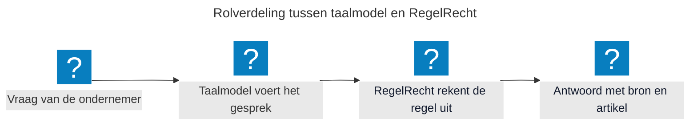

Bij demonstraties van de Digitale Assistent komen steeds dezelfde vragen terug. Waarom is dit een goede oplossing? Waarom gebruiken we RegelRecht? En waarom kiezen we voor een bot, met alle bezwaren die daarbij horen? Op deze pagina beantwoorden we die vragen, inclusief de nadelen en de vraagstukken die nog openstaan.

## Waarom is dit een goede oplossing?

Een ondernemer die wil weten of een verplichting voor zijn bedrijf geldt, zoekt dat nu zelf uit. Welke regel geldt, welke organisatie gaat erover, welke gegevens zijn nodig en welk formulier hoort erbij? Die stappen zijn verdeeld over verschillende websites en organisaties, terwijl het voor de ondernemer één vraag is. De Digitale Assistent brengt die stappen samen in één gesprek, van de vraag tot het indienen van de rapportage. Daarmee bereiken we:

* **Voor ondernemers:** één vraag in gewone taal, in plaats van zelf uitzoeken welke regel geldt en welke organisatie erover gaat. De uitleg gaat over de eigen situatie en de ondernemer kan direct overgaan tot handelen.
* **Voor overheidsorganisaties:** de informatievoorziening en de uitvoering rekenen met dezelfde regel. Wat de assistent zegt, is wat elders ook wordt uitgerekend en wat een formulier of medewerker zou moeten antwoorden.
* **Voor de digitale overheid:** een modulaire, open source opzet waarin elke bron een losse aansluiting is. Een organisatie die haar eigen regelhulp, register of regeling wil koppelen, hoeft de assistent niet opnieuw te bouwen.

Bij elk antwoord leggen we de herkomst vast: welke bron is geraadpleegd, welk artikel van toepassing is, op welk moment en met welke gegevens. De ondernemer leest daarmee na waar het antwoord op steunt, en wij verantwoorden achteraf hoe de uitkomst tot stand kwam. Bij een wijziging in de regelgeving wordt die op één plek doorgevoerd en werkt die door in de hele keten.

De POC werkt op dit moment voor één casus: de informatieplicht energiebesparing. De KVK draait op de testomgeving, RVO is gesimuleerd en de assistent is nog niet aangesloten op een productieomgeving. Opschalen naar meer wetten en meer uitvoeringsorganisaties is de volgende stap.

## Waarom gebruiken we RegelRecht?

[RegelRecht](https://regelrecht.rijks.app/) maakt wetgeving uitvoerbaar als code, met een bijbehorende uitrekenmachine. Daarmee ondervangen we het grootste risico van een AI-assistent bij de overheid: het taalmodel interpreteert de wet niet. Het taalmodel begrijpt de vraag van de ondernemer en voert het gesprek, de uitkomst komt van RegelRecht. Niet een chatbot bepaalt dus of een ondernemer aan een verplichting moet voldoen, maar de regel zelf.

Die rolverdeling levert vier dingen op:

* **Een herhaalbare uitkomst:** een taalmodel geeft op dezelfde vraag soms een net iets ander antwoord, een berekening niet. Dezelfde gegevens leiden altijd tot dezelfde uitkomst, en die uitkomst is te controleren.
* **Eén plek voor wijzigingen:** verandert de wet, dan passen we de regel op één plek aan. Alle kanalen die RegelRecht gebruiken, rekenen daarna met de nieuwe regel.
* **Een uitlegbaar antwoord:** RegelRecht geeft de wettelijke grondslag terug, zodat de assistent verwijst naar het artikel waar de uitkomst op steunt.
* **Hergebruik in plaats van zelf bouwen:** RegelRecht bestaat al en heeft een eigen team. We sluiten aan en werken samen, in plaats van een eigen regelmotor te bouwen naast wat er al is.

Dat de uitkomst uit een berekening komt, betekent niet dat die klopt. Een wet moet eerst worden omgezet naar RegelRecht en dat is voor weinig wetten gebeurd. Belangrijker: die omzetting moet gevalideerd worden. Weerspiegelen de machine-uitvoerbare wetten daadwerkelijk wat de wet bedoelt en hoe uitvoeringsorganisaties die in de praktijk toepassen? Zonder deze validatie is de betrouwbaarheid van de gehele keten onzeker. Daarom is validatie een van onze [vervolgstappen](/onderwerpen/digitale-assistent/#hoe-gaan-we-nu-verder).

## Waarom bots? De voor- en nadelen

Met een bot bedoelen we hier een assistent die de ondernemer in gewone taal te woord staat. De ondernemer stelt een vraag, de assistent raadpleegt de bronnen die daarbij horen en begeleidt de ondernemer tot en met de actie. Die vorm heeft duidelijke voordelen, en net zo duidelijke nadelen.

### Voordelen

* **De ondernemer hoeft de weg niet te kennen.** De vraag wordt gesteld zoals die aan een adviseur gesteld zou worden. De assistent zoekt uit welke organisatie en welke regel erbij horen.
* **Uitleg in gewone taal, over de eigen situatie.** In plaats van algemene voorlichting op een website krijgt de ondernemer antwoord op de eigen situatie, met de gegevens van het eigen bedrijf erbij.
* **Doorvragen kan.** Is een antwoord onduidelijk, dan vraagt de ondernemer verder. Bij een formulier of een informatiepagina kan dat niet.
* **Van informeren naar handelen in één gesprek.** De ondernemer leest niet alleen wat er moet gebeuren, maar doet het na bevestiging ook meteen.
* **Altijd beschikbaar.** Ook buiten kantoortijden en zonder wachtrij.

### Nadelen

* **Een taalmodel verzint antwoorden.** Het formuleert vloeiend en overtuigend, ook wanneer het antwoord niet klopt.
* **Antwoorden zijn niet identiek.** Dezelfde vraag levert een andere formulering op, terwijl de overheid consistent moet zijn.
* **Een vlot antwoord wekt vertrouwen.** De ondernemer controleert het minder snel dan een brief of een beschikking.
* **Het gesprek verbergt de onderbouwing.** In een chat is minder zichtbaar op welke gegevens en regels een antwoord rust dan in een formulier of een besluit.
* **Niet iedereen wil chatten.** Een deel van de ondernemers wil een overzicht, een formulier of een medewerker aan de lijn.
* **Een taalmodel brengt kosten, energieverbruik en afhankelijkheid mee.** Zeker als de overheid modellen van commerciële leveranciers gebruikt.

### Hoe we de nadelen ondervangen

De opzet van de Digitale Assistent is het antwoord op deze nadelen. Het taalmodel rekent niet: de uitkomst komt van RegelRecht en de gegevens komen uit de registers. Bij elk antwoord toont de assistent de bron en het artikel, zodat de ondernemer de uitkomst controleert. Handelen gebeurt pas na een expliciete bevestiging, bijvoorbeeld bij het indienen van een rapportage bij RVO. De assistent werkt in een afgebakende omgeving, met vaste bronnen en vaste instructies.

De assistent is een extra kanaal en geen vervanging. Het portaal, het formulier en de medewerker blijven bestaan voor ondernemers die daar de voorkeur aan geven. Een bot is dus geen doel op zich. Het is de laag waarmee een ondernemer een vraag in gewone taal stelt. Wat daarachter gebeurt, moet kloppen, herleidbaar zijn en op dezelfde bron rusten als de rest van de dienstverlening.

Daarmee zijn we er nog niet. Deze vraagstukken staan open en daar kunnen we jouw input bij gebruiken:

* Wie is verantwoordelijk als de assistent een fout antwoord geeft, en hoe leggen we dat vast met de uitvoeringsorganisaties?
* Hoe toetsen we of ondernemers begrijpen wat er gebeurt, de uitkomst vertrouwen en weten wat zij ermee moeten doen?
* Welke eisen stellen we aan het taalmodel zelf, bijvoorbeeld op het gebied van privacy, leveranciersafhankelijkheid en energieverbruik?

Meedenken of aansluiten? Kijk bij [Doe mee en help ons met openstaande vraagstukken](/onderwerpen/digitale-assistent/#doe-mee-en-help-ons-met-openstaande-vraagstukken).
