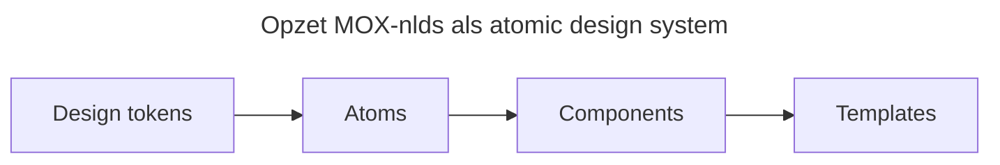

## Wat is MOX-nlds?

MOX-nlds is een design systeem voor de ontwikkeling van de [MijnOverheid Zakelijk portaal](portaal). In potentie kan het systeem ook ingezet worden voor andere interfaces binnen het MijnOverheid Zakelijk ecosysteem (zoals b.v. deze website).
Een design systeem is een verzameling van herbruikbare componenten, richtlijnen en standaarden die consistentie en efficiëntie bevorderen in het ontwerp en de ontwikkeling van digitale producten. Omdat we de vormgeving baseren op de richtlijnen van de Rijkshuisstijl, is MOX-nlds naast MOZa producten ook (uiteindelijk) te gebruiken voor andere webapplicaties/websites, zoals b.v. [Mijn Overheid](https://mijnoverheid.nl), [PRO websites](https://www.platformrijksoverheidonline.nl/). In principe alles dat moet voldoen aan de Rijkshuisstijl.

## Rijkshuisstijl Community Design Systeem / NLDS

Momenteel is het [Rijkshuisstijl Community Design Systeem](https://www.rijkshuisstijl-community.nl/) (RHC-nlds) in ontwikkeling. Dit is een initiatief dat het bovenstaande doel ook heeft, en de _NLDS_ aanpak daarin hanteert als leidraad. De belangrijkste uitgangspunten daarin zijn:

- **Design tokens gebruik**: via een `JSON` bestand worden allerlei styling eigenschappen (kleuren, fonts, groottes, line-heights, etc) vastgelegd. Deze `JSON` dient als de _single source of truth_ en kan vertaald worden naar Figma (voor designers) of CSS (voor developers). Een gebruiker kan deze tokens naar gelieven aanpassen voor een 'eigen sausje' over de Rijkshuisstijl.
- **Herbruikbare componenten**: b.v. een breadcrumb hoeft maar één keer ontworpen en ontwikkeld te worden, waarna andere sites / partijen deze kunnen importeren en gebruiken.
- **Estafettemodel**: een concept waarin meerdere partijen samenwerken om componenten te verbeteren om ze tot een _production-ready_ te krijgen (zie: [estafettemodel](https://www.nldesignsystem.nl/handboek/estafettemodel/)). Een partij die iets mist kan dat bouwen en toevoegen aan het Rijkshuisstijl Community Design System, waarna anderen het kunnen doorontwikkelen.

## Waarom kunnen we het Rijkshuisstijl Community Design Systeem niet gebruiken?

Momenteel is het RHC-nlds nog in ontwikkeling. De manier waarop RHC-nlds opgezet is zorgt echter voor een aantal problemen waardoor MijnOverheid Zakelijk er niet goed mee kan werken:

- De componenten zijn zeer inconsistent in styling, kwaliteit, naamgeving en gebruik. Dit komt door het estafettemodel waar componenten uit diverse hoeken komen, maar een centrale controle-check ontbreekt.
- De design-tokens (`JSON`) zijn opgezet voor _elk_ component, wat een wildgroei heeft opgeleverd. De hoeveelheid is zo groot dat we er niet goed meer mee overweg kunnen.
- Tegelijkertijd missen de componenten vaak weer nét de dingen die je zou willen aanpassen.
- Aanpassen van componenten is lastig: een simpel tekst-blok in een `<Badge>` kan compleet anders werken dan een tekst-blok in een `<Button>` en vaak moet je custom zelf iets bouwen. Design-tokens gebruiken voor consistente vormgeving is daarbij link: deze veranderen vaak, waardoor je styling zal breken zonder dat je dat weet.
- Er is geen goed fluid (responsive) type/spacing-systeem opgezet in de basis

## Wat maakt een overheidsbreed design systeem goed bruikbaar?

Wat je uit het Design Systeem voor alle overheids-partijen wilt is:

- Kant en klare componenten die gewoon goed werken (i.e. responsive zijn, kunnen werken met dark-mode, zeer voorspelbaar zijn in styling en gebruik)
- De mogelijkheid om deze componenten open te maken en aan te passen, zonder dat je hoeft te _opt-out_'en. Je wilt nog steeds gebruik maken van de onderliggende regels voor spacing, kleuren, etc.

## Aanpak MOX-nlds

We pakken de goede ideëen uit RHC-nlds op, en bouwen onze eigen stabiele basis voor een Design Systeem.

> Wat MOX-nlds is: gebruiksgemak, voorspelbaarheid en flexibiliteit

### Atomic design system

We zetten ons design systeem _atomisch_ op. Dat betekent dat we enkele bouwlagen hebben:

- **Atoms**: de kleinste bouwblokken (zoals een tekst, een box, een radio-button). Deze leunen op de design tokens.
- **Components** (aka **Molecules** en **Organisms**): opgebouwd uit **Atoms** (zoals een radio-button met label, correcte spacing en foutmelding-optie) Components maken expliciet geen gebruik meer van de design tokens.
- **Templates**: opgebouwd uit **Atoms** en **Molecules**. Grote kant-en-klare blokken zoals bijvoorbeeld een compleet contact-formulier.

Als je een kant en klaar component nodig hebt zonder enige aanpassingen, dan is een **component** of zelfs een **template** geschikt. Heb je meer _fine-grained control_ nodig wat het component niet biedt, dan kijk je in Storybook hoe het component opgezet is. Je kan met de **atoms** vervolgens je eigen component opzetten met aanpassingen waar nodig.

Atoms zijn zeer voorspelbaar opgezet. Hun gedrag en mogelijkheden tot aanpassen zijn altijd hetzelfde, wat zorgt dat je als developer snel je eigen componenten kan opzetten.

Zie voor meer informatie de Storybook: [Atomisch systeem](https://minbzk.github.io/moza-mox-nlds/?path=/docs/atomic-system--docs).

### Fluid type/spacing systeem

Zodra tekst op een kleiner scherm kleiner wordt, moet bijvoorbeeld de afstand tussen een radio-button en zijn label ook meeschalen. Dit moet je in de basis goed opzetten.

Zie voor meer informatie de Storybook: [Scaling systeem](https://minbzk.github.io/moza-mox-nlds/?path=/docs/scaling-system--docs)

## Werkwijze & status

Momenteel verkeert het MOX-nlds nog in een alpha-versie.

Er wordt via het [prototype](https://www.mijnoverheidzakelijk.nl/onderwerpen/ontwerpprincipes/) gewerkt aan componenten die getest worden in UX-onderzoeken. Zodra een component qua design goed bevonden is, kan het verwerkt worden tot een component in MOX-nlds. Momenteel zijn er al een aantal componenten klaar.

Momenteel ligt de focus op het bouwen van een goede basis voor de **atoms**, waarna we snel **componenten** kunnen bijbouwen. Deze worden dan toegepast in de MijnOverheid Zakelijk portaal.

## Relevante links

- [De Storybook voor MOX-nlds](https://minbzk.github.io/moza-mox-nlds/?path=/docs/intro--docs).
- [Rijkshuisstijl Community Design System](https://www.rijkshuisstijl-community.nl/)
- [NL Design System](https://www.nldesignsystem.nl)
