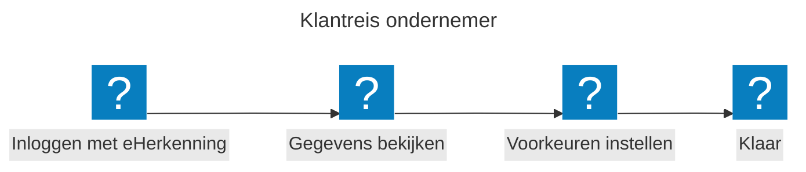
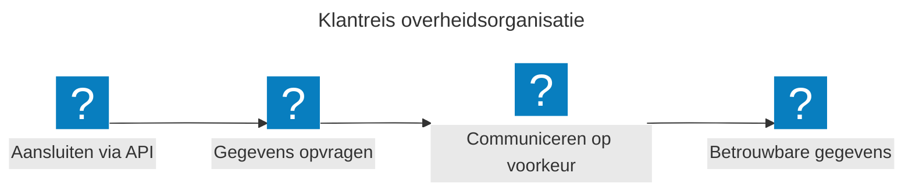
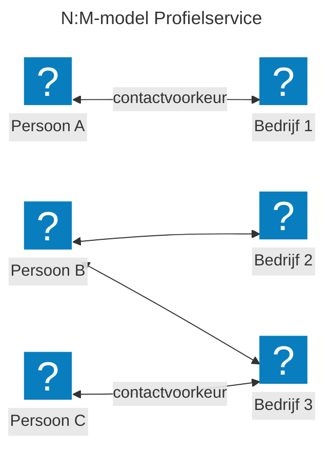

## Wat is de profielservice?

De profielservice is een centrale plek waar ondernemers hun contactgegevens en communicatievoorkeuren met de overheid beheren. Denk aan: wil je e-mail, post of sms ontvangen? En op welk adres? Je stelt dit één keer in en alle aangesloten overheidsorganisaties gebruiken dezelfde gegevens.

### Wat kun je als ondernemer?

Je logt in met eHerkenning, bekijkt je gegevens en stelt je communicatievoorkeuren in. Dat is alles. Je hoeft dit niet meer apart te doen bij elke overheidsorganisatie.

### Wat kunnen overheidsorganisaties?

Overheidsorganisaties sluiten aan via een gestandaardiseerde API. Zij vragen de contactgegevens en voorkeuren op die de ondernemer heeft ingesteld. Zo communiceren zij altijd op de manier die de ondernemer heeft gekozen.

## Waarom is dit nodig?

Nu slaan overheidsorganisaties contactgegevens los van elkaar op. Ondernemers voeren dezelfde gegevens steeds opnieuw in bij verschillende portalen. Dat kost tijd en leidt tot fouten.

De profielservice lost dit op:

- **Voor ondernemers:** je beheert je gegevens op één plek. Minder administratie, betere communicatie.
- **Voor overheidsorganisaties:** je krijgt actuele en betrouwbare gegevens uit één centrale bron.
- **Voor de digitale overheid:** een herbruikbare bouwsteen die past binnen de Generieke Digitale Infrastructuur (GDI).

## Hoe werkt het?

Een ondernemer kan bij meerdere bedrijven betrokken zijn. En een bedrijf kan meerdere contactpersonen hebben. De profielservice houdt hier rekening mee: je kunt per bedrijf andere voorkeuren instellen.

In dit diagram staat elke pijl voor een contactvoorkeur. Persoon B is bijvoorbeeld betrokken bij bedrijf 2 en bedrijf 3, en kan voor elk bedrijf een andere voorkeur instellen.

## Hoe bouwen we dit?

We bouwen de profielservice stap voor stap in vier fasen:

1. **Basisprofiel** — E-mailadres, telefoonnummer, postadres en één algemene contactvoorkeur.
2. **Meer voorkeuren** — Ondernemers kunnen per situatie een andere contactvoorkeur aangeven.
3. **Bronregisters koppelen** — We koppelen registers zoals KvK, BRP en BAG zodat gegevens niet dubbel worden opgeslagen.
4. **Overheidsorganisaties aansluiten** — Organisaties sluiten aan via standaard-API's en gebruiken de profielgegevens.

We volgen open standaarden: de Nederlandse Richtlijn Digitale Systemen (NeRDS), NORA, NL GOV API Design Rules en GDI-richtlijnen. Toegang regelen we via eHerkenning en eIDAS.

## Doe mee

De profielservice bouwen we samen met beleidsmakers, ontwerpers, ontwikkelaars en uitvoeringsorganisaties. Wil je meedenken of meebouwen? Dat kan.

Bekijk onze voortgang en broncode op GitHub: [GitHub profielservice](https://github.com/MinBZK/moza-profiel-service)
