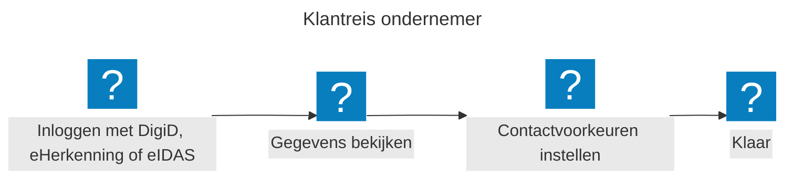
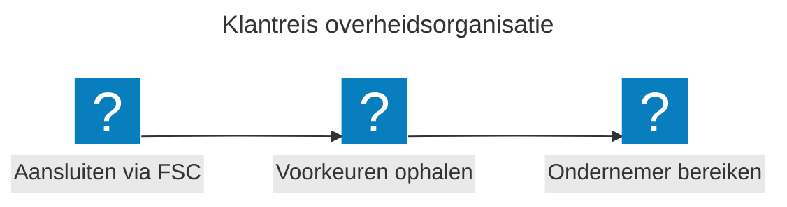
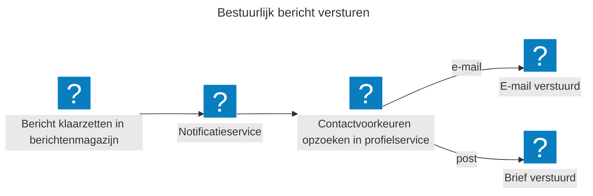
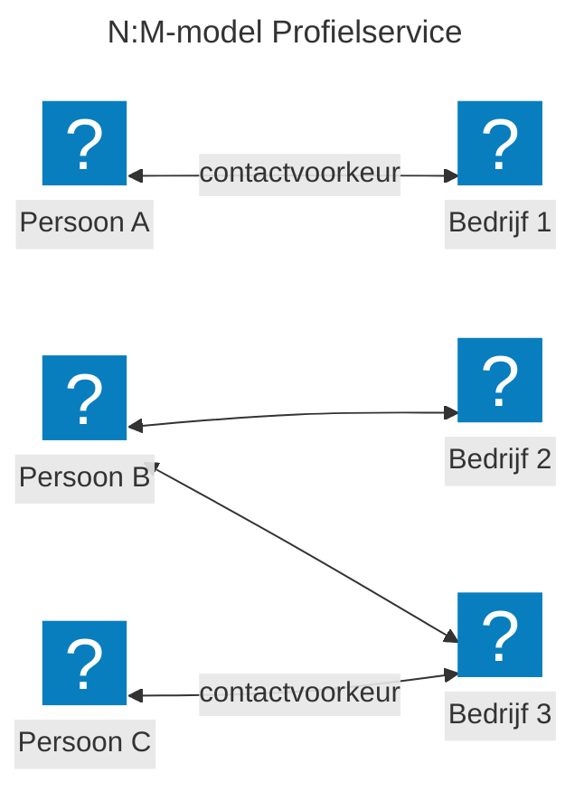

## Wat is de profielservice?

De profielservice is een centrale plek waar burgers en ondernemers hun contactgegevens en -voorkeuren met de overheid beheren. Denk aan: wil je e-mail of post? En op welk adres? Je stelt dit één keer in en alle aangesloten overheidsorganisaties gebruiken dezelfde gegevens. Wil je iets wijzigen? Dat doe je op dezelfde plek en de nieuwe gegevens zijn direct beschikbaar.

### Wat kun je als ondernemer?

Je logt in met DigiD, eHerkenning of een Europees inlogmiddel (eIDAS), bekijkt je gegevens en stelt je contactvoorkeuren in. Dat is alles. Je hoeft dit niet meer apart te doen bij elke overheidsorganisatie.

- **Contactvoorkeur** — op welke manier wil je benaderd worden? Denk aan e-mail, post of sms.
- **Contactgegevens** — op welk adres bereiken we je? Dat kan een e-mailadres zijn, maar ook een fysiek postadres.

### Wat kunnen overheidsorganisaties?

Overheidsorganisaties sluiten eenmalig aan via [Federatieve Service Connectiviteit (FSC)](https://fsc-standaard.nl/) en [Federatieve Toegangsverlening (FTV)](https://vng-realisatie.github.io/ftv/). Bij elk contactmoment halen zij de contactvoorkeuren van de ondernemer op en bereiken zij de ondernemer op de manier die deze zelf heeft gekozen.

#### Voorbeeld: bestuurlijk bericht versturen

Een overheidsorganisatie zet een bestuurlijk bericht klaar in het berichtenmagazijn. De notificatieservice zoekt via de profielservice de contactvoorkeur van de ondernemer op. Bij voorkeur voor e-mail gaat er een e-mailnotificatie uit. De ondernemer kan daarna in de berichtenbox het bericht lezen. Bij voorkeur voor post ontvangt de ondernemer een brief. Zo bepaalt de ondernemer zelf hoe die wordt bereikt.

## Waarom is dit nodig?

Nu slaan overheidsorganisaties contactgegevens los van elkaar op. Burgers en ondernemers voeren dezelfde gegevens steeds opnieuw in bij verschillende portalen. Dat kost tijd en leidt tot fouten.

De profielservice lost dit op:

- **Voor burgers en ondernemers:** je beheert je gegevens op één plek. Minder administratie, betere communicatie.
- **Voor overheidsorganisaties:** je krijgt actuele en betrouwbare gegevens uit één centrale bron.
- **Voor de digitale overheid:** een herbruikbare bouwsteen die past binnen de [Generieke Digitale Infrastructuur (GDI)](https://www.digitaleoverheid.nl/mido/generieke-digitale-infrastructuur-gdi/).

## Hoe werkt het?

De profielservice slaat centraal de contactvoorkeuren op die alle overheidsorganisaties kunnen gebruiken. Daarnaast slaat de profielservice contactgegevens op die nog geen plek hebben in een centraal register.

Dit opslaan gebeurt per combinatie van persoon en bedrijf. Een overheidsorganisatie vraagt de contactvoorkeur op voor een specifiek bedrijf en krijgt de gegevens van de juiste contactpersonen terug.

Een ondernemer kan bij meerdere bedrijven betrokken zijn. En een bedrijf kan meerdere contactpersonen hebben. Dit heet een N:M-model. De profielservice houdt hier rekening mee. Daarbij kun je per bedrijf andere contactvoorkeuren instellen.

In dit diagram staat elke pijl voor een contactvoorkeur. Persoon A is betrokken bij één bedrijf en heeft één contactvoorkeur. Persoon B is betrokken bij bedrijf 2 én bedrijf 3, en kan voor elk bedrijf een andere contactvoorkeur instellen. En bedrijf 3 heeft twee mogelijke contactpersonen: persoon B en persoon C.

## Hoe bouwen we dit?

We bouwen de profielservice stap voor stap in drie fasen:

1. **Basisprofiel** — E-mailadres, telefoonnummer, postadres en een algemene contactvoorkeur. Later kun je meer contactvoorkeuren instellen.
2. **Bronregisters koppelen** — We koppelen registers zoals KVK, BRP en BAG zodat gegevens niet dubbel worden opgeslagen.
3. **Overheidsorganisaties aansluiten** — Organisaties sluiten aan via standaard-API's op basis van [Federatieve Service Connectiviteit (FSC)](https://fsc-standaard.nl/) en gebruiken de profielgegevens.

Bij de ontwikkeling volgen we de [principes](/handboek/werkwijze/principes/) van MOZa. We zoeken actief de samenwerking op, hanteren open standaarden en treden op als betrouwbare partij waar privacy en transparantie hoog in het vaandel staan. Al bij het ontwerp denken we na over minimale dataverwerking en het vastleggen van gegevensverwerkingen.

## Doe mee

De profielservice bouwen we samen met mensen uit diverse organisaties en vakgebieden — van beleid en ontwerp tot juridisch en techniek. Want deze voorziening heeft alleen waarde als alle overheidsorganisaties meedoen. We nodigen je uit om mee te denken, mee te bouwen en kennis te delen. Benieuwd? Sluit je aan en [praat met ons mee!](contact.md)

## Meer info

- [Voortgang en broncode op GitHub](https://github.com/MinBZK/moza-profiel-service)
- [Technische documentatie](https://docs.mijnoverheidzakelijk.nl/workspace/documentation/Profiel%20Service)
- Uitproberen in [het portaal MijnOverheid Zakelijk](https://moza.mijnoverheidzakelijk.nl/) als onderdeel van [de proeftuin](proeftuin.md)
