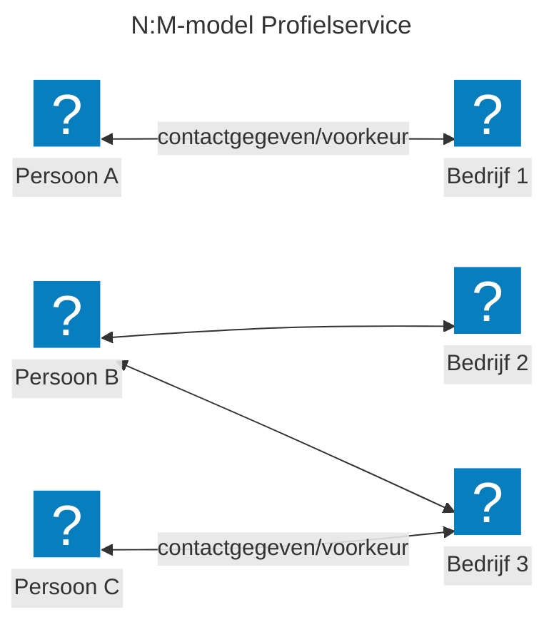
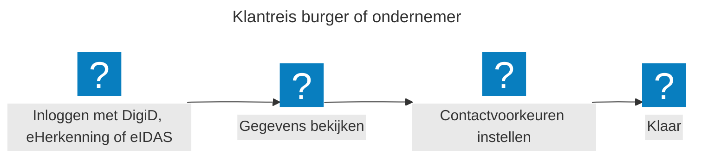
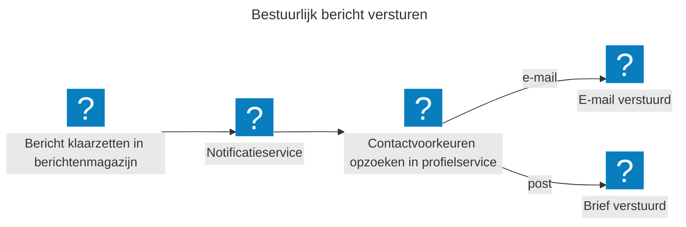
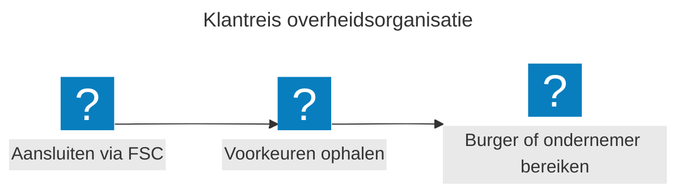

## Huidige uitdaging

Overheidsorganisaties (dienstverleners, gemeenten) slaan contactgegevens en voorkeuren los van elkaar (decentraal) op. Burgers en ondernemers voeren daarom dezelfde gegevens steeds opnieuw in bij verschillende portalen. Dat kost tijd en leidt tot fouten. Daarnaast worden op verschillende plekken dezelfde functionaliteiten (door)ontwikkeld. Een centrale profielservice biedt de oplossing. Daarmee bereiken we:

* **Voor burgers en ondernemers:** je kunt je gegevens vanuit verschillende portalen aanpassen, maar ze worden centraal op één plek opgeslagen. Minder administratie, betere communicatie.
* **Voor overheidsorganisaties/dienstverleners:** je krijgt actuele en betrouwbare gegevens uit één centrale bron.
* **Voor de digitale overheid:** een herbruikbare bouwsteen die past binnen de [Generieke Digitale Infrastructuur (GDI)](https://www.digitaleoverheid.nl/mido/generieke-digitale-infrastructuur-gdi/).

## Wat is de profielservice?

De profielservice is een centrale plek waar burgers en ondernemers hun contactgegevens en voorkeuren met de overheid beheren. Denk aan: wil je e-mail of post? En op welk adres? Je stelt je voorkeuren in vanuit een portaal, en ze worden centraal opgeslagen. Alle aangesloten overheidsorganisaties gebruiken dezelfde gegevens. Wil je iets wijzigen? Dat kan vanaf elk portaal en de nieuwe gegevens zijn direct beschikbaar.

## De oplossing

Hieronder lichten we de belangrijkste uitgangspunten van de profielservice toe en hoe deze werkt voor burgers, ondernemers en overheidsorganisaties.

### Gegevens vastlegging

De profielservice werkt met drie begrippen: een **identificatie**, een **contactgegeven** en een **voorkeur**. Elke vastlegging koppelt een contactgegeven of voorkeur aan een identificatie (de unieke 'sleutel' om gegevens terug te vinden).

* **Identificatie**: hoe ben je uniek herkenbaar? Denk aan BSN, KVK-nummer, RSIN of een ander identificerend nummer.[^identificatie-personen]
* **Contactgegeven**: waar kun je worden bereikt? Denk aan een specifiek e-mailadres, postadres of telefoonnummer.
* **Voorkeur**: hoe wil je worden bereikt? Denk aan voorkeur voor e-mail boven post, of in welke taal je liever leest.

[^identificatie-personen]: Bij de toepassing bij personen in relatie tot ondernemingen bestaat de identificatie uit twee onderdelen: een persoonskenmerk (bijvoorbeeld BSN) en een organisatiekenmerk (bijvoorbeeld KVK-nummer of RSIN). Dit kan dus naast de koppeling KVK-nummer-contactgegeven bestaan.

### Type gegevens

De profielservice bevat alleen gegevens die nog niet ergens anders zijn vastgelegd én die dienstverleners helpen hun primaire processen beter uit te voeren. Concreet gaat het om contactgegevens (zoals e-mail of postadres) en voorkeuren (zoals contactmedium of taal). Persoonlijke kenmerken zoals pasfoto's slaan we niet op.

### Koppeling

De unieke vastlegging wordt gekoppeld aan een **dienstverlener** en eventueel een **dienst**:

* **Dienstverlener** is bijvoorbeeld *Gemeente Amsterdam* of *Belastingdienst*.
* **Dienst** wordt vastgesteld door, en is daarmee altijd gekoppeld aan, een **dienstverlener**. Voorbeelden hiervan zijn Zorg (binnen Amsterdam) of Omzetbelasting (binnen Belastingdienst).[^dienst-niet-verplicht]

[^dienst-niet-verplicht]: Een dienst is niet verplicht. Een contactgegeven of voorkeur kan ook alleen aan een dienstverlener gekoppeld zijn.

Een burger of ondernemer kan contactgegevens en -voorkeuren instellen per dienstverlener, en optioneel per dienst. Binnen een dienst is geen verdere onderverdeling mogelijk. Zo voorkomen we dat iemand voor verschillende onderdelen binnen één dienst aparte voorkeuren moet beheren, wat in de praktijk al snel honderden combinaties zou opleveren.

### Hergebruik gegevens

Een ondernemer kan bij meerdere bedrijven betrokken zijn. En een bedrijf kan meerdere contactpersonen hebben. Daarom kun je met de profielservice per bedrijf andere contactvoorkeuren instellen. De profielservice slaat contactvoorkeuren op per combinatie van persoon en bedrijf. Dit heet een N:M-model: veel personen kunnen gekoppeld zijn aan veel bedrijven. Een overheidsorganisatie vraagt het contactgegeven op voor een specifiek bedrijf en krijgt de gegevens van de juiste contactpersonen terug.

In dit diagram staat elke pijl voor een contactvoorkeur. Persoon A is betrokken bij één bedrijf en heeft één contactvoorkeur. Persoon B is betrokken bij bedrijf 2 én bedrijf 3. Voor elk bedrijf kan persoon B een ander contactgegeven en/of voorkeur instellen. Bedrijf 3 heeft twee contactpersonen: persoon B en persoon C.

### Verificatie contactgegeven

De profielservice kan een contactgegeven verifiëren. Wordt er een nieuw contactgegeven toegevoegd dat nog niet is geverifieerd, maar dat we wel willen verifiëren? Dan start de profielservice de verificatie automatisch.

Op dit moment is verificatie alleen mogelijk voor het contactgegeven e-mail.

Heeft een dienstverlener het contactgegeven al zelf geverifieerd? Dan geeft die dat door bij het toevoegen of wijzigen. De profielservice start dan geen nieuwe verificatie.

### Hoe werkt dit voor burgers en ondernemers?

Je logt in met DigiD, eHerkenning of een Europees inlogmiddel (eIDAS), bekijkt je gegevens en stelt je contactvoorkeuren en bijbehorende gegevens in. Dat is alles. Je hoeft dit niet meer apart te doen bij elke overheidsorganisatie; je past het centraal aan.

### Hoe werkt dit voor overheidsorganisaties?

Er zijn twee toepassingen:

#### 1. Indirect gebruik door instanties

In dit geval wordt de profielservice gebruikt binnen het notificatieproces. Een overheidsorganisatie geeft alleen aan naar wie en wat er verstuurd moet worden, en de notificatiedienst zoekt via de profielservice op hoe en waarop de ontvanger het liefst benaderd wordt.

Een overheidsorganisatie zet een bestuurlijk bericht klaar in het berichtenmagazijn. De notificatiedienst zoekt via de profielservice het contactgegeven en/of voorkeur van de burger of ondernemer op. Bij voorkeur voor e-mail gaat er een e-mailnotificatie uit dat er een bericht klaar staat. Dit bericht kan daarna in een berichtenbox gelezen worden. Bij voorkeur voor post wordt er een brief verstuurd. Zo bepaalt de burger of ondernemer zelf hoe die wordt bereikt.

#### 2. Direct gebruik door instanties

In dit geval bevraagt een overheidsorganisatie de profielservice rechtstreeks om te bepalen hoe zij een burger of ondernemer kan bereiken.

Overheidsorganisaties sluiten eenmalig aan via [Federatieve Service Connectiviteit (FSC)](https://fsc-standaard.nl/) en [Federatieve Toegangsverlening (FTV)](https://vng-realisatie.github.io/ftv/). Bij elk contactmoment halen zij de contactvoorkeuren van de burger of ondernemer op en bereiken zij de burger of ondernemer op de manier die deze zelf heeft gekozen.

## Huidige status

We brengen de profielservice naar een bètaversie, waarbij we zowel de techniek als de juridische kant waarborgen. We pakken dit stap voor stap aan.

Wat de profielservice technisch kan, is meer dan wat we nu functioneel inzetten. Die grens wordt bepaald door het juridische proces.

De eerste versie richt zich op de functionele toepassing binnen het notificatieproces, zoals aangeboden in de [notificatiedienst](/onderwerpen/notificatiedienst/).

Hieronder beschrijven we eerst de functionele inzet, daarna de bredere technische mogelijkheden.

### Functioneel

In deze eerste versie ondersteunt de profielservice de volgende functionele toepassingen:

1. Een burger of ondernemer kan via een overheidsportaal de voorkeur (e-mail of fysiek) en eventueel bijbehorende gegevens (e-mailadres) invoeren.
   * We willen hierbij zoveel mogelijk uitgaan van één e-mailadres dat overheidsbreed bruikbaar is.
2. Wanneer er een notificatie verstuurd moet worden, bevraagt de notificatiedienst de profielservice. De overheidsinstantie moet daarbij de identifier(s) meesturen waaronder de ontvanger in de profielservice bekend is.

Er wordt onderzocht welke (juridische) opties we hebben, en wat er daarvoor georganiseerd moet worden, om ook het directe gebruik van de profielservice door een overheidsinstantie te faciliteren.

### Technisch

In deze eerste versie kijken we verder dan alleen deze functionele toepassing. Vanuit de techniek zijn de volgende zaken ingeregeld:

* Koppelen van unieke identifiers (**identificatie-contactgegeven** en **identificatie-voorkeur**) aan de verschillende overheidsorganisaties en eventuele specifieke diensten.
* Mogelijkheid tot het instellen van een primaire voorkeur.
* Mogelijkheid tot het instellen van verschillende voorkeuren, waaronder:
  * SMS
  * App-id's
  * Taal
* Mogelijkheid tot het verwijderen van gegevens (gekoppeld aan specifieke uitgangspunten).
* Mogelijkheid tot het opvragen van informatie, ook door derde partijen (onder andere als onderdeel van [Federatieve Service Connectiviteit (FSC)](https://fsc-standaard.nl/) en [Federatieve Toegangsverlening (FTV)](https://vng-realisatie.github.io/ftv/)).

## Vervolgstappen

We blijven de profielservice verder ontwikkelen, waarbij we ons nu richten op:

* Voorbereiden op beheer door Logius
* Verfijning van functionaliteiten, zoals het verwijderen van gegevens

Voor de volledige en meest recente backlog, bekijk de taak ["Profielservice" op GitHub](https://github.com/MinBZK/MijnOverheidZakelijk/issues/24).

## Onze werkwijze

Bij de ontwikkeling volgen we de [principes](/handboek/werkwijze/principes/) van MOZa. We zoeken actief de samenwerking op, hanteren open standaarden en treden op als betrouwbare partij waar privacy en transparantie hoog in het vaandel staan. Al bij het ontwerp denken we na over minimale dataverwerking en het vastleggen van gegevensverwerkingen.

## Meedoen

De profielservice bouwen we samen met mensen uit diverse organisaties en vakgebieden, van beleid en ontwerp tot juridisch en techniek. Want deze voorziening heeft alleen waarde als alle overheidsorganisaties meedoen. We nodigen je uit om mee te denken, mee te bouwen en kennis te delen. Benieuwd? Sluit je aan en [praat met ons mee!](/contact/)

## Meer info

* [Voortgang en broncode op GitHub](https://github.com/MinBZK/moza-profiel-service)
* [Technische documentatie](https://docs.mijnoverheidzakelijk.nl/workspace/documentation/Profiel%20Service)
* Uitproberen in [het portaal MijnOverheid Zakelijk](https://moza.mijnoverheidzakelijk.nl/) als onderdeel van [de proeftuin](/onderwerpen/proeftuin/)
