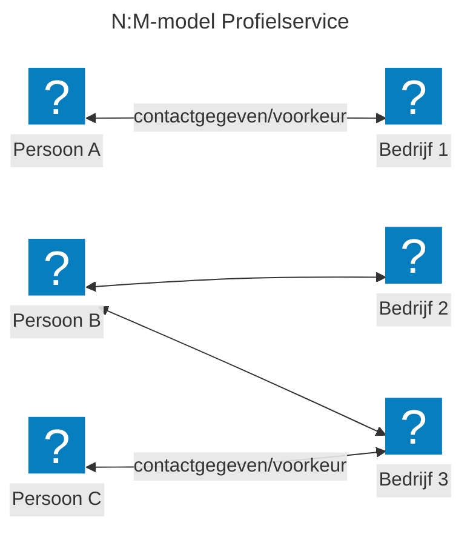
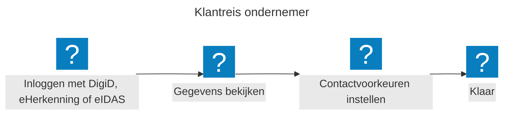
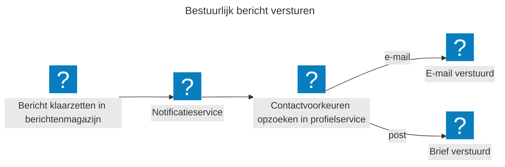
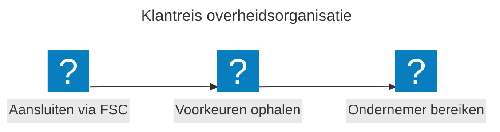

## Huidige uitdaging

Overheidsorganisaties (dienstverleners, gemeenten) slaan contactgegevens en voorkeuren los van elkaar (decentraal) op. Burgers en ondernemers voeren daarom dezelfde gegevens steeds opnieuw in bij verschillende portalen. Dat kost tijd en leidt tot fouten. Daarnaast worden op verschillende plekken dezelfde functionaliteiten (door)ontwikkeld. Een centrale profielservice biedt de oplossing. Daarmee bereiken we:

* **Voor burgers en ondernemers:** je kunt je gegevens vanuit verschillende portalen aanpassen, maar ze worden centraal op één plek opgeslagen. Minder administratie, betere communicatie.

* **Voor overheidsorganisaties/dienstverleners:** je krijgt actuele en betrouwbare gegevens uit één centrale bron.

* **Voor de digitale overheid:** een herbruikbare bouwsteen die past binnen de [Generieke Digitale Infrastructuur (GDI)](https://www.digitaleoverheid.nl/mido/generieke-digitale-infrastructuur-gdi/).

## Wat is de profielservice?

De profielservice is een centrale plek waar burgers en ondernemers hun contactgegevens en voorkeuren met de overheid beheren. Denk aan: wil je e-mail of post? En op welk adres? Je stelt dit vanuit een door jou gewenste manier in één keer in, in het centrale profiel, en alle aangesloten overheidsorganisaties gebruiken dezelfde gegevens. Wil je iets wijzigen? Dat doe je op dezelfde plek en de nieuwe gegevens zijn direct beschikbaar.

## De oplossing

Hieronder lichten we de belangrijkste uitgangspunten van de profielservice toe en hoe deze werkt voor ondernemers en overheidsorganisaties.

### Gegevens vastlegging

Er wordt uitgegaan van een unieke **identificatie-contactgegeven** en/of **identificatie-voorkeur** vastlegging. Dit is de unieke 'sleutel' waaraan de profielservicegegevens gekoppeld worden.

* **Identificatie** - op welke manier is de identiteit uniek herkenbaar? Denk aan bijvoorbeeld BSN, KVK-nummer, RSIN of een ander nummer.[^identificatie-personen]
* **Contactgegeven** - op welke manier wil je benaderd worden? Denk aan e-mail, post of sms of alternatieven.
* **Voorkeur** - welke voorkeuren heb je met betrekking tot overheidsinteracties? Denk aan taal of site-thema.

[^identificatie-personen]: Bij de toepassing bij personen in relatie tot ondernemingen bestaat de identificatie uit twee onderdelen: een persoonskenmerk (bijvoorbeeld BSN) en een organisatiekenmerk (bijvoorbeeld KVK-nummer of RSIN). Dit kan dus naast de koppeling KVK-nummer-contactgegeven bestaan.

### Type gegevens

De profielservice bevat alleen gegevens over identiteiten die van toepassing zijn op de primaire processen van dienstverleners. Dat betekent concreet dat de profielservice vooralsnog geen pasfoto's of andere persoonlijke kenmerken bevat, indien deze niet noodzakelijk zijn voor de uitvoering van een primair proces.

### Koppeling

De unieke vastlegging wordt gekoppeld aan een **dienstverlener** en eventueel een **dienst**:

* **Dienstverlener** is bijvoorbeeld *Gemeente Amsterdam* of *Belastingdienst*.
* **Dienst** wordt vastgesteld door - en is daarmee altijd gekoppeld aan - een **dienstverlener**. Voorbeelden hiervan zijn Zorg (binnen Amsterdam) of Omzetbelasting (binnen Belastingdienst).[^dienst-niet-verplicht]

[^dienst-niet-verplicht]: Een dienst is niet verplicht - een contactgegeven of voorkeur kan ook alleen aan een dienstverlener gekoppeld zijn.

Er is voor gekozen om vooralsnog geen additionele verdere specificatie binnen een dienst toe te kunnen passen. Dat betekent dat een dienstverlener op één niveau de contactgegeven & -voorkeuren kan specificeren.

### Hergebruik gegevens

Een ondernemer kan bij meerdere bedrijven betrokken zijn. En een bedrijf kan meerdere contactpersonen hebben. Daarom kun je met de profielservice per bedrijf andere contactvoorkeuren instellen. De profielservice slaat contactvoorkeuren op per combinatie van persoon en bedrijf. Dit heet een N:M-model: veel personen kunnen gekoppeld zijn aan veel bedrijven. Een overheidsorganisatie vraagt het contactgegeven op voor een specifiek bedrijf en krijgt de gegevens van de juiste contactpersonen terug.

In dit diagram staat elke pijl voor een contactvoorkeur. Persoon A is betrokken bij één bedrijf en heeft één contactvoorkeur. Persoon B is betrokken bij bedrijf 2 én bedrijf 3. Voor elk bedrijf kan persoon B een ander contactgegeven en/of voorkeur instellen. Bedrijf 3 heeft twee contactpersonen: persoon B en persoon C.

### Verificatie contactgegeven

De profielservice kan (indien gewenst) het contactgegeven verifiëren. Op het moment dat een nieuwe toevoeging op de profielservice wordt geïnitieerd waarbij het contactgegeven nog niet is geverifieerd, zal de profielservice dit proces initiëren.

Op dit moment is verificatie alleen mogelijk voor het contactgegeven e-mail.

Indien een dienstverlener zelf de verificatie heeft uitgevoerd, kan dit bij de toevoeging of aanpassing worden meegegeven. De profielservice zal hiervoor geen verificatie initiëren.

### Hoe werkt dit voor de ondernemer?

Je logt in met DigiD, eHerkenning of een Europees inlogmiddel (eIDAS), bekijkt je gegevens en stelt je contactvoorkeuren en bijbehorende gegevens in. Dat is alles. Je hoeft dit niet meer apart te doen bij elke overheidsorganisatie; je past het centraal aan.

### Hoe werkt dit voor overheidsorganisaties?

De toepassing is tweeledig:

#### 1. Indirect gebruik door instanties

In dit geval gaat het over de toepassing van de profielservice in het notificatieproces. Hierbij hoeft een overheidsorganisatie alleen aan te geven naar wie en wat er verstuurd moet worden. Hierbij wordt de profielservice in het notificatieproces gebruikt voor de bepaling op welke manier en naar welke ontvanger de betreffende notificatie verstuurd moet worden.

##### Voorbeeld: bestuurlijk bericht versturen

Een overheidsorganisatie zet een bestuurlijk bericht klaar in het berichtenmagazijn. De notificatiedienst zoekt via de profielservice het contactgegeven en/of voorkeur van de ondernemer op. Bij voorkeur voor e-mail gaat er een e-mailnotificatie uit. De ondernemer kan daarna in de berichtenbox het bericht lezen. Bij voorkeur voor post ontvangt de ondernemer een brief. Zo bepaalt de ondernemer zelf hoe die wordt bereikt.

#### 2. Direct gebruik door instanties

Overheidsorganisaties sluiten eenmalig aan via [Federatieve Service Connectiviteit (FSC)](https://fsc-standaard.nl/) en [Federatieve Toegangsverlening (FTV)](https://vng-realisatie.github.io/ftv/). Bij elk contactmoment halen zij de contactvoorkeuren van de ondernemer op en bereiken zij de ondernemer op de manier die deze zelf heeft gekozen.

## Huidige status

De profielservice wordt verder gebracht naar een bètaversie, waarbij de toepassing zowel vanuit de techniek alsook juridisch geborgd wordt. De fasering van de profielservice ziet er als volgt uit:

### In ontwikkeling

We onderkennen hierbij een verschil tussen wat technisch al mogelijk is, en hoe de profielservice daadwerkelijk functioneel zal worden ingezet. De techniek zal in staat zijn tot meer dan de daadwerkelijk toepassing zoals voorzien vanuit het juridische proces.

De eerste versie die live zal gaan richt zich op de functionele toepassing binnen het notificatieproces - zoals aangeboden in de notificatiedienst. Hieronder volgt daarmee een uiteenzetting met welke functionaliteiten de profielservice wordt ingezet, en daaronder welke verdere mogelijkheden de profielservice heeft.

### Functioneel

In deze eerste versie ondersteunt de profielservice de volgende functionele toepassingen:

1. De ondernemer kan via een overheidsportaal de voorkeur (e-mail of fysiek) en eventueel bijbehorende gegevens (e-mailadres) invoeren.
   * Het is de intentie om hierbij zoveel mogelijk uit te gaan van één e-mailadres, waarbij de toepassing overheidsbreed is.
2. De notificatiedienst kan de profielservice bevragen wanneer er een notificatie uitgestuurd moet worden. Hierbij dient een overheidsinstantie bij het initiëren van een notificatie ook de juiste identifier(s) mee te sturen, zoals de ontvanger bekend is in de profielservice.

Er wordt onderzocht welke (juridische) opties we hebben, en wat er daarvoor georganiseerd moet worden, om ook het directe gebruik van de profielservice door een overheidsinstantie te faciliteren.

### Technisch

Er wordt in deze eerste versie verder gekeken dan alleen deze functionele toepassing. Vanuit de techniek zijn de volgende zaken ingeregeld:

* Koppelen van unieke identifiers (**identificatie-contactgegeven** en **identificatie-voorkeur**) aan de verschillende overheidsorganisaties en eventuele specifieke diensten.
* Mogelijkheid tot het instellen van een primaire voorkeur.
* Mogelijkheid tot het instellen van verschillende voorkeuren, waaronder:
  * SMS
  * App-id's
  * Taal
* Mogelijkheid tot het verwijderen van gegevens (gekoppeld aan specifieke uitgangspunten).
* Mogelijkheid tot het opvragen van informatie, ook door derde partijen (onder andere als onderdeel van [Federatieve Service Connectiviteit (FSC)](https://fsc-standaard.nl/) en [Federatieve Toegangsverlening (FTV)](https://vng-realisatie.github.io/ftv/)).

### Vervolgstappen

We bekijken de vervolgstappen vanuit verschillende perspectieven:

#### MOZa

Vanuit MOZa blijven we de profielservice verder ontwikkelen, waarbij we ons nu richten op:

* Inbeheername bij Logius
* Verfijning van specifieke functionaliteiten (onder andere verwijderen van gegevens)

Voor de volledige en meest recente backlog, bekijk de taak ["Profielservice" op GitHub](https://github.com/MinBZK/MijnOverheidZakelijk/issues/24).

## Onze werkwijze

Bij de ontwikkeling volgen we de [principes](https://mijnoverheidzakelijk.nl/handboek/werkwijze/principes/) van MOZa. We zoeken actief de samenwerking op, hanteren open standaarden en treden op als betrouwbare partij waar privacy en transparantie hoog in het vaandel staan. Al bij het ontwerp denken we na over minimale dataverwerking en het vastleggen van gegevensverwerkingen.

## Meedoen

De profielservice bouwen we samen met mensen uit diverse organisaties en vakgebieden - van beleid en ontwerp tot juridisch en techniek. Want deze voorziening heeft alleen waarde als alle overheidsorganisaties meedoen. We nodigen je uit om mee te denken, mee te bouwen en kennis te delen. Benieuwd? Sluit je aan en [praat met ons mee!](https://mijnoverheidzakelijk.nl/contact/)

## Meer info

* [Voortgang en broncode op GitHub](https://github.com/MinBZK/moza-profiel-service)

* [Technische documentatie](https://docs.mijnoverheidzakelijk.nl/workspace/documentation/Profiel%20Service)

* Uitproberen in [het portaal MijnOverheid Zakelijk](https://moza.mijnoverheidzakelijk.nl/) als onderdeel van [de proeftuin](https://mijnoverheidzakelijk.nl/onderwerpen/proeftuin/)
