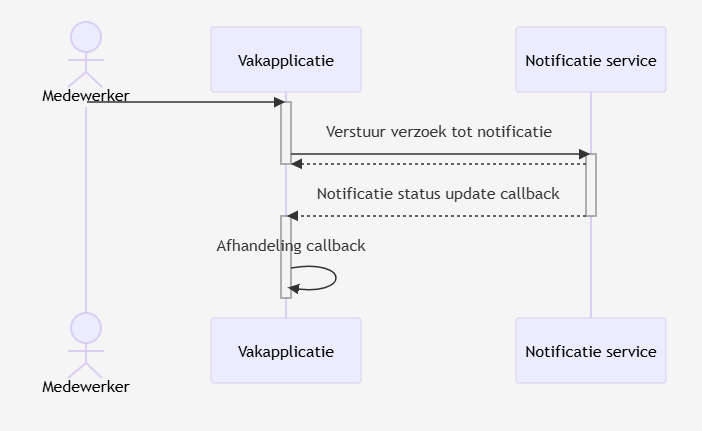

# 3. Scenario bepaling

Date: 2025-07-08

## Status

Proposed

## Context

Vanuit de buisiness kregen we de vraag om scenarios op basis van architectuur vraagstukken van Paul Jansen uit te werken tot documenatie en ook prototypes.

### Scenario 2

Bij scenario 2 maken alle (vak)applicaties van bijv. het UWV, de belastingdienst of RVO allemaal direct verbinding met de notificatie service (Of dit nou Notify of een alternatief is)

#### Scenario 2

  
Zie mermaid code

  
    sequenceDiagram
        actor Medewerker
        Medewerker->>Vakapplicatie:
        activate Vakapplicatie
        Vakapplicatie->>Notificatie service:Verstuur verzoek tot notificatie
        activate Notificatie service
        Notificatie service-->>Vakapplicatie:
        deactivate Vakapplicatie
        Notificatie service-->>Vakapplicatie:Notificatie status update callback
        deactivate Notificatie service
        activate Vakapplicatie
        Vakapplicatie->>Vakapplicatie:Afhandeling callback
        deactivate Vakapplicatie

Voordelen:

- Geen ontwikkelwerk voor een generiek component

Nadelen:

- Elke overheids organisatie moet zelf connectie opzetten met de notificatie service die op dit moment niet al te best gedocumenteerd is
- Elke overheids organisatie moet zelf een implementatie verzinnen en opzetten om te voldoen aan de wet MEBV
- Geen centrale / federatieve opslag van alle contactmomenten mogelijk
- Organisatie moet zelf kanaal herstel inrichten

### Scenario 8

Bij scenario 8 komt er een generiek component tussen de (vak)applicaties van alle organisaties en de notificatie service. Deze kan verschillende problemen wegnemen voor de organsaties, zoals het opslaan van alle contactmomenten, kanaal herstel en het eenduidig praten met de notificatie service.

Dit component wordt ontwikkeld door het MijnOverheidZakelijk team maar komt wel bij de organisaties zelf te draaien. Het zelfde principe als dat de gemeentes nu doen met het OMC van worth systems

**_OMC - is een placeholder term totdat we een goede benaming hebben voor deze service_**

#### Scenario 8

  
Zie mermaid code

  
    sequenceDiagram
        actor Medewerker
        Medewerker->>Vakapplicatie:
        activate Vakapplicatie
        Vakapplicatie->>OMC:Verstuur verzoek tot notificatie
        deactivate Vakapplicatie
        activate OMC
        OMC->>Profiel service:Haal contact inforamtie op o.b.v. kvknummer
        activate Profiel service
        Profiel service-->>OMC:
        deactivate Profiel service
        OMC->>Notificatie service:Verstuur verzoek tot notificatie
        activate Notificatie service
        deactivate OMC

        Notificatie service-->>OMC:Notificatie status update callback
        deactivate Notificatie service
        activate OMC
        alt status = mislukt
            OMC->>Profiel service:Haal adres gegevens op o.b.v. kvknummer
            activate Profiel service
            Profiel service-->>OMC:
            deactivate Profiel service
            OMC->>Notificatie service:Stuur verzoek tot brief
            activate Notificatie service
            Notificatie service-->>OMC:Brief callback
            deactivate Notificatie service
        end
        deactivate OMC
        OMC-->>Vakapplicatie:Optionele callback

Voordelen:

- Elke overheids organisatie hoeft alleen eenduidig aan te sluiten op onze OMC, deze ingang kan samen met deze organisaties worden gespecificeerd en opgezet
- Wij ontzorgen de gebruikers als zei het Email-adres van de ontvanger niet weten, als input kan dan het KVK nummer worden gegeven en regelen wij de rest
- Wij geven een optie voor poging tot kanaalherstel, hierdoor wordt voldaan aan de wet MEBV

Nadelen:

- Organisaties moeten zelf de nieuwe versies uitrollen op het platform als deze gereleased worden door ons
- Moet nog ontwikkeld worden

## Decision

Wij hebben deze 2 scenario's uitgwerkt en zijn tot de conclussie komen hier een aantal dingen in te missen.

- Om te verkomen dat een bedrijf meerdere brieven ontvangt moet hier een centrale service voor komen
- De contactmomenten moeten worden opgeslagen op een federatieve manier zodat een nog te ontwikkelen service deze kan uitlezen

## Consequences

Het gevolg is dat we de uitgewerkte scenario's 2 en 8 moeten gaan vervangen met een uitwerking die ook de bovenstaande punten implementeert
