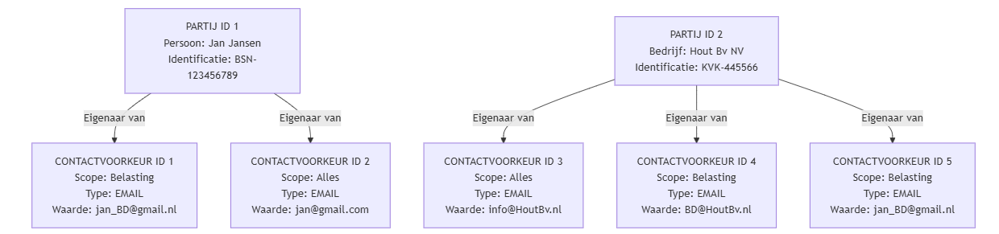

# 8. Eigenaar van contactvoorkeur-data

Date: 2025-11-13

## Status

Accepted

## Context

Binnen de profielservice worden contactvoorkeuren vastgelegd, zoals e-mailadressen, telefoonnummers en (woon)adressen.  
Deze gegevens kunnen persoonsgegevens bevatten en vallen daardoor onder de bescherming van de AVG.

In de huidige modellering zijn er twee relevante rollen:

- **Ontvangende Partij:** de partij (persoon of organisatie) die het contactmiddel beheert of bezit.
- **Betreffende Partij:** de partij (persoon of organisatie) waarop de communicatie betrekking heeft.

De vraag is wie in juridisch en functioneel opzicht de ‘eigenaar’ is van de contactvoorkeur:  
Is dat de Ontvangende Partij (die het contactmiddel beheert), of de Betreffende Partij (waarvoor de contactvoorkeur geldt)?

## Scenario beschrijving

De RVO wil contact opnemen met **HoutBv**, waarvan het KVK-nummer _123_ is.  
In de profielservice staat bij HoutBv het e-mailadres **jan@gmail.com** als contactvoorkeur.  
Jan Jansen is de persoon achter dit e-mailadres en werkt namens HoutBv.

In dit scenario:

- **Ontvangende Partij:** Jan Jansen (de partij die het e-mailadres beheert)
- **Betreffende Partij:** HoutBv (de partij waarvoor contact wordt opgenomen)

De kernvraag is dus:

- Is de contactvoorkeur van **Jan Jansen**, omdat het zijn e-mailadres is? (**Optie 1**)
- Of is de contactvoorkeur van **HoutBv**, omdat het de organisatie is waarmee contact moet worden opgenomen? (**Optie 2**)

> Een kanttekening is hier dat kijkend naar de profielservice voor burgers personen en organisaties beide rollen kunnen vervullen.

### Architectuurdiagram

#### Optie 1 - Ontvangende Partij is eigenaar.

_(de persoon of organisatie die het contactmiddel bezit is eigenaar)_


<details>
  <summary>Zie mermaid code</summary>
    ```mermaid
    graph TD
        %% Personen / Bedrijven
        P0["PARTIJ ID 0<br>Persoon: Hans Eigenaar<br>Identificatie: BSN-456789"]
        P1["PARTIJ ID 1<br>Persoon: Jan Jansen<br>Identificatie: BSN-123456789"]
        P2["PARTIJ ID 2<br>Bedrijf: Steen BV<br>Identificatie: KVK-112233"]
        P3["PARTIJ ID 3<br>Bedrijf: Hout Bv NV<br>Identificatie: KVK-445566"]

        %% Contactvoorkeuren van Jan
        C0["CONTACTVOORKEUR ID 0<br>Scope: Alles<br>Type: EMAIL<br>Waarde: hans@SteenBv.nl"]
        C1["CONTACTVOORKEUR ID 1<br>Scope: Belasting<br>Type: EMAIL<br>Waarde: jan@SteenBv.nl"]
        C2["CONTACTVOORKEUR ID 2<br>Scope: Alles<br>Type: EMAIL<br>Waarde: jan@gmail.com"]
        C3["CONTACTVOORKEUR ID 3<br>Scope: Belasting<br>Type: EMAIL<br>Waarde: jan@HoutBv.nl"]

        %% Contactvoorkeur van bedrijf
        C4["CONTACTVOORKEUR ID 4<br>Scope: Alles<br>Type: EMAIL<br>Waarde: info@HoutBv.com"]

        %% Relaties van Jan
        P0 -->|Eigenaar van| C0
        P1 -->|Eigenaar van| C1
        C0 -->|Betreffend Partij| P2
        C1 -->|Betreffend Partij| P2

        P1 -->|Eigenaar van| C2

        P1 -->|Eigenaar van| C3
        C3 -->|Betreffend Partij| P3


        %% Relatie van Hout Bv zelf
        P3 -->|Eigenaar van| C4
    ```

</details>

#### Optie 2 - Betreffende Partij is eigenaar.

_(de persoon of organisatie waar het contactmiddel betrekking op heeft is eigenaar)_



<details>
  <summary>Zie mermaid code</summary>

    ```mermaid
    graph TD
        %% Personen / Bedrijven
        P1["PARTIJ ID 1<br>Persoon: Jan Jansen<br>Identificatie: BSN-123456789"]
        P2["PARTIJ ID 2<br>Bedrijf: Hout Bv NV<br>Identificatie: KVK-445566"]

        %% Contactvoorkeuren van Jan
        C1["CONTACTVOORKEUR ID 1<br>Scope: Belasting<br>Type: EMAIL<br>Waarde: jan_BD@gmail.nl"]
        C2["CONTACTVOORKEUR ID 2<br>Scope: Alles<br>Type: EMAIL<br>Waarde: jan@gmail.com"]

        %% Contactvoorkeur van bedrijf
        C3["CONTACTVOORKEUR ID 3<br>Scope: Alles<br>Type: EMAIL<br>Waarde: info@HoutBv.nl"]
        C4["CONTACTVOORKEUR ID 4<br>Scope: Belasting<br>Type: EMAIL<br>Waarde: BD@HoutBv.nl"]
        C5["CONTACTVOORKEUR ID 5<br>Scope: Belasting<br>Type: EMAIL<br>Waarde: jan_BD@gmail.nl"]

        %% Relaties van Jan
        P1 -->|Eigenaar van| C1
        P1 -->|Eigenaar van| C2


        %% Relatie van Hout Bv zelf
        P2 -->|Eigenaar van| C3
        P2 -->|Eigenaar van| C4
        P2 -->|Eigenaar van| C5
    ```

</details>

### Consequenties

**Optie 1 – Ontvangende Partij is eigenaar**

1. Wanneer een partij mandaat verliest, wordt de contactvoorkeur ongeldig. Omdat de contactvoorkeur eigendom is van de partij die het mandaat verloor, moet die partij zelf de voorkeur aanpassen. Alternatief is dat de profielservice een seintje ontvangt van de mandaatservice (bijv. via een queue).
2. De partij waarmee de dienstverlener contact wil opnemen, kan niet direct inzien via welke kanalen dit gebeurt. Zij hebben partij X mandaat gegeven, maar weten niet hoe partij X benaderd wil worden. _(Ze kunnen wel zichzelf of meerdere partijen als ontvanger opnemen, zodat de dienstverlener naar beide kan sturen.)_
3. Ondersteunt scenario’s waarin één contactmiddel namens meerdere betreffende partijen wordt gebruikt, zonder dat het automatisch geldt voor alle communicatie.
4. AVG minder privacygevoelig omdat de persoonsgegevens harder gekoppeld zijn aan de persoon van wie deze zijn.
5. Complexere implementatie.

**Optie 2 – Betreffende Partij is eigenaar**

1. Persoonsgegevens kunnen opgeslagen zijn onder het ‘eigendom’ van een andere partij. Dit brengt risico’s met zich mee rond verwerking van persoonsgegevens zonder expliciete toestemming.
2. Lastiger om één contactvoorkeur voor meerdere partijen te hergebruiken.
3. Eenvoudigere implementatie.
4. Realistischer in uitwerking qua hoe ondernemers & burgers zouden omgaan met de omgeving.

### Conclusie

Wij hebben ervoor gekozen om in deze fase optie 2 te implementeren, omdat wij verwachten dat deze oplossing beter aansluit bij de ondernemers en burgers die van de profielservice gebruik zullen maken. Wel geldt hierbij de kanttekening dat per contactgegeven een taalvoorkeur moet worden vastgelegd, omdat deze kan afwijken van de taalvoorkeur van de partij waaraan het contactgegeven is gekoppeld.
