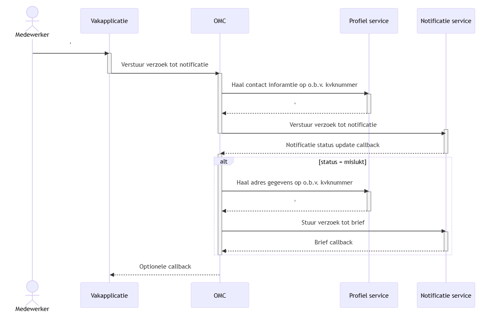

## Functioneel overzicht

### Inleiding

Dit hoofdstuk bouwt voort op de context en verwijst naar aanvullende documentatie en diagrammen.
Het biedt kort en duidelijk inzicht in wat de Notificatie Service doet, voor wie het dat doet en hoe de belangrijkste informatiestromen lopen.

### Overzicht

De Notificatie Service biedt één generieke voorziening waarmee overheidsorganisaties notificaties (attenderingen/kennisgevingen) kunnen aanmaken, routeren en afleveren via meerdere kanalen (o.a. e‑mail, sms, push en toekomstige kanalen). 
De service schermt kanaalspecifieke verschillen af, respecteert voorkeuren en doelbinding.

Wat het systeem feitelijk doet, is notificatieverzoeken betrouwbaar aannemen, verrijken, en afleveren, met observatie op status en foutafhandeling. 
Belangrijke gebruikers en hun behoeften zijn:
- Dienstverlener/Vakapplicaties: via API een notificatie kunnen aanmaken, met feedback over (tussen)status en eindresultaat.
- Kanaalproviders/voorzieningen (bijv. NotifyNL): gestandaardiseerde aansturing en terugmeldingen via uniforme contracten.

#### Kernfunctionaliteiten in het kort:
- Notificaties aanmaken: API voor het registreren van een notificatieverzoek met metadata (template, correlatie‑ID).
- Routering en aflevering: aanbieden aan het juiste kanaal of provider; ondersteunen van meerdere providers en failover.
- Status & callbacks: vastleggen van (tussen)statussen; callbacks/webhooks naar de aanroeper; idempotente statusupdates.
- Retries & dead‑lettering: configureerbare retry‑strategie per kanaal; Dead Letter Queue (DLQ) voor niet‑afleverbare berichten.
- Logging & audit: gebeurtenissen vastleggen conform LDV; correlatie‑ID’s voor traceerbaarheid end‑to‑end.

#### Belangrijkste processen en informatiestromen:
1. Aanname notificatieverzoek – Een vakapplicatie doet een verzoek tot notificatie.
   - De Notificatie Service valideert het verzoek, bewaart een initiële status (bijv. Accepted/Queued).
   - Koppelt terug wanneer de status uiteindelijk naar Succeeded/Failed gaat.

2. Kanaalkeuze en voorkeursverwerking – De aannamen is dat de vakapplicatie de kanaal en voorkeur al heeft vastgelegd.
   - In sommige van de scenario's is de notificatie service wel verantwoordelijk voor kanaalherstel & het ophalen van adresgegevens.

3. Aflevering en status – De service biedt het bericht aan bij de gekozen provider (bijv. NotifyNL) en registreert tussenstappen (Enqueued, Sent, Delivered/Failed).
   - Callbacks vanaf de provider worden verwerkt en beschikbaar gesteld aan de aanroeper.

4. Retries, failover en fallback – Bij tijdelijke fouten worden retries toegepast met circuit-breaker 'back‑off''.
   - Indien overeengekomen, kan de OMC als fallback overschakelen naar een alternatieve kanaalstrategie.  
   - ^ TODO DISCUSSIEPUNT, moet het mogelijk zijn een geprioriteerde lijst van contactmethodes op kunnen sturen naar de notificatie service

#### Scenario’s

Onderstaande scenario’s illustreren de samenwerking tussen vakapplicatie, Notificatie Service, Profiel Service en verzendvoorzieningen.
Dit zijn de welbekende scenario's over hoe overheidsdiensten zouden kunnen interacteren met de Notificatie Service.
Scenario 9 staat hier nog niet, maar is idem aan scenario 8, met de toevoeging van kanaalherstel.

##### Scenario 2 — Vakapplicatie belt direct de Notificatie Service

  
Zie mermaid code

  
    mermaid
    sequenceDiagram
        actor Medewerker
        Medewerker->>Vakapplicatie:
        activate Vakapplicatie
        Vakapplicatie->>Notificatie service:Verstuur verzoek tot notificatie
        activate Notificatie service
        Notificatie service-->>Vakapplicatie:
        deactivate Vakapplicatie
        Notificatie service-->>Vakapplicatie:Notificatie status update callback
        deactivate Notificatie service
        activate Vakapplicatie
        Vakapplicatie->>Vakapplicatie:Afhandeling callback
        deactivate Vakapplicatie

##### Scenario 8 — Vakapplicatie via OMC met profielverrijking en fallback

  
Zie mermaid code

    
    mermaid
    sequenceDiagram
        actor Medewerker
        Medewerker->>Vakapplicatie:'
        activate Vakapplicatie
        Vakapplicatie->>OMC:Verstuur verzoek tot notificatie
        deactivate Vakapplicatie
        activate OMC
        OMC->>Profiel service:Haal contact inforamtie op o.b.v. kvknummer
        activate Profiel service
        Profiel service-->>OMC:'
        deactivate Profiel service
        OMC->>Notificatie service:Verstuur verzoek tot notificatie
        activate Notificatie service
        deactivate OMC
        
        Notificatie service-->>OMC:Notificatie status update callback
        deactivate Notificatie service
        activate OMC
        alt status = mislukt
        OMC->>Profiel service:Haal adres gegevens op o.b.v. kvknummer
        activate Profiel service
        Profiel service-->>OMC:'
        deactivate Profiel service
        OMC->>Notificatie service:Stuur verzoek tot brief
        activate Notificatie service
        Notificatie service-->>OMC:Brief callback
        deactivate Notificatie service
        end
        deactivate OMC
        OMC-->>Vakapplicatie:Optionele callback

