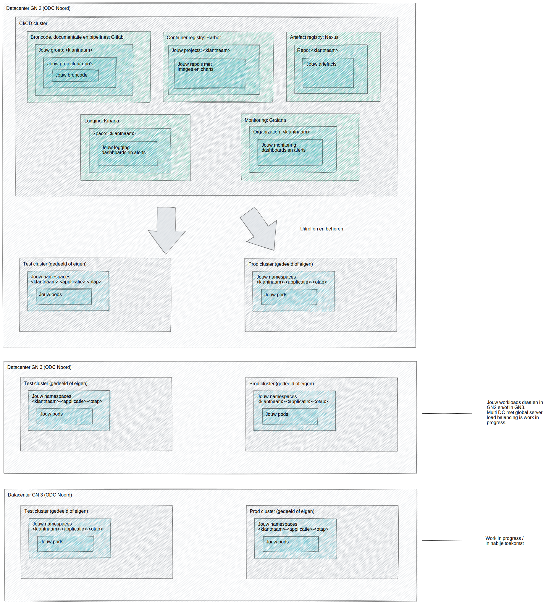
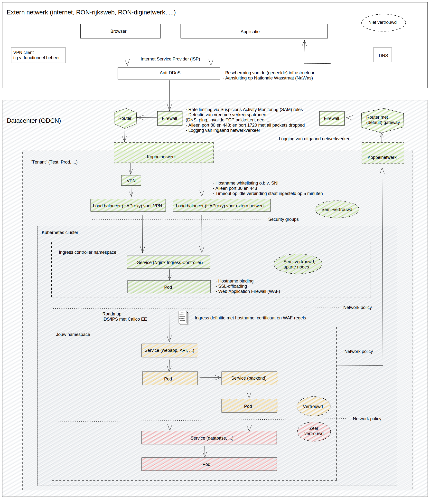
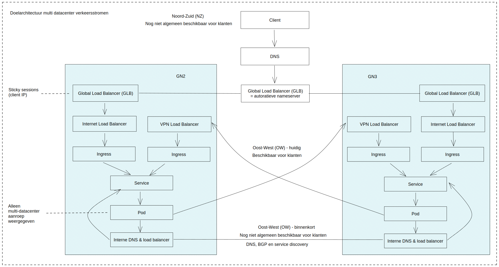

## Infrastructuur Architectuur

> De meeste documentatie gaat over de software zelf, maar hier kan de infrastructuur beschreven worden.  
> Zie ook: [Inhoud guidelines Infrastructuur Architectuur](https://structurizr.com/help/documentation/infrastructure-architecture)

### Infrasctuctuur Standaard Platform

Alle software systemen binnen het landschap Vertegenwoordigen draaien op het Standaard Platform van Logius. Dit is een door Logius gehoste container infrastructuur op basis van Kubernetes. Meer informatie hierover is te vinden op de website van Logius: https://logius.nl/diensten/standaard-platform.

Verdere technische informatie en tal van voorbeeld applicaties is te vinden op de Wiki van het Standaard Platform:

-   [Standaard Platform Wiki](https://gitlab.cicd.s15m.nl/sp-docs/publiek/-/wikis/home)

Ook op bovenstaande Wiki te vinden, maar een snel toegankelijk overzicht van de infrastructuur is:

### Klantomgeving

### Verkeersbeeld

### Multi Data Center

