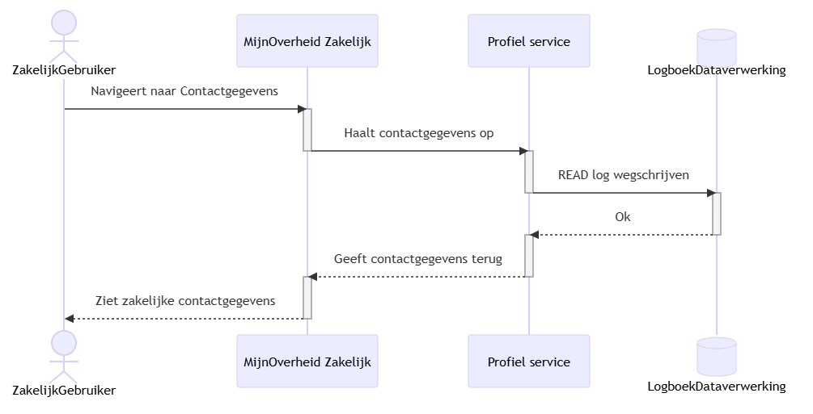

## Code

### Profiel Beheren

Hierin staan de patronen beschreven over hoe een zakelijke gebruiker zijn profiel zou beheren.

#### Profiel bekijken

  
Zie mermaid code

  
    sequenceDiagram
        actor ZakelijkGebruiker
        ZakelijkGebruiker->>MijnOverheid Zakelijk: Navigeert naar Contactgegevens
        activate MijnOverheid Zakelijk
        MijnOverheid Zakelijk->>Profiel service:Haalt contactgegevens op
        deactivate MijnOverheid Zakelijk
        activate Profiel service
        Profiel service->>Logboek Dataverwerking: READ log wegschrijven
        deactivate Profiel service
        activate Logboek Dataverwerking
        Logboek Dataverwerking-->>Profiel service: Ok
        deactivate Logboek Dataverwerking
        activate Profiel service
        Profiel service-->>MijnOverheid Zakelijk: Geeft contactgegevens terug
        deactivate Profiel service
        activate MijnOverheid Zakelijk
        MijnOverheid Zakelijk-->>ZakelijkGebruiker: Ziet zakelijke contactgegevens
        deactivate MijnOverheid Zakelijk

#### Email updaten & verifiëren

  
Zie mermaid code

  
    sequenceDiagram
        actor ZakelijkGebruiker
        ZakelijkGebruiker->>MijnOverheid Zakelijk: Update email Request
        activate MijnOverheid Zakelijk
        MijnOverheid Zakelijk->>Profiel service: Verstuurt email update
        deactivate MijnOverheid Zakelijk
        activate Profiel service
        participant AuditLog@{ "type" : "database" }
        participant EmailVerificatieService
        Profiel service->>AuditLog: 'Update aangevraagd'-log opslaan
        deactivate Profiel service
        activate AuditLog
        AuditLog-->>Profiel service: Ok
        deactivate AuditLog
        activate Profiel service
        Profiel service->>EmailVerificatieService: Start verificatieprocess
        deactivate Profiel service
        activate EmailVerificatieService
        EmailVerificatieService-->>ZakelijkGebruiker: Verstuur mail met verificatiecode
        deactivate EmailVerificatieService
        activate ZakelijkGebruiker
        ZakelijkGebruiker-)MijnOverheid Zakelijk: Verifieer email verificatiecode
        deactivate ZakelijkGebruiker
        activate MijnOverheid Zakelijk
        MijnOverheid Zakelijk->>Profiel service: Verstuurt verificatie verzoek
        deactivate MijnOverheid Zakelijk
        activate Profiel service
        Profiel service->>EmailVerificatieService:  Verifieer verificatie verzoek
        deactivate Profiel service
        activate EmailVerificatieService
        EmailVerificatieService-->>Profiel service: Bevestig verificatie
        deactivate EmailVerificatieService
        activate Profiel service
        Profiel service->>AuditLog: 'Update geverifieerd'-log opslaan
        deactivate Profiel service
        activate AuditLog
        AuditLog-->>Profiel service: Ok
        deactivate AuditLog
        activate Profiel service
        Profiel service-->>MijnOverheid Zakelijk: Profiel gegevens
        deactivate Profiel service
        activate MijnOverheid Zakelijk
        MijnOverheid Zakelijk-->>ZakelijkGebruiker: Succes pagina
        deactivate MijnOverheid Zakelijk

### Authenticatie

Hierin staan de patronen beschreven over hoe het inlog process van een zakelijke gebruiker of organisatie zou verlopen.
Aan het einde van dit hoofdstuk worden de te verwachten attributen per inlogmethode beschreven, met daarbij aangegeven welke verplicht of optioneel zijn.
Eerst is een flow chart te zien die aangeeft wat de ondernemer kan verwachten aan de hand van de inlogmethode die hij/zij gebruikt.

  
Zie mermaid code

        flowchart TD;
        %% Trigger
            TRIGGER([De ondernemer wilt zijn contactgegevens updaten])-->S1;

        %% DigId scenario
            S1[Het systeem laat de inlog opties zien: 1. Digid, 2. eHerkenning, 3. eIDas als Burger 4. eIDas als Organisatie]-->S2;
            S2[De ondernemer kiest Digid]-->S3;
            S3[Het systeem met behulp van het BSN haalt hij de relevant KVK's op bij de KVK-BSN api.];
            S3-->SUCCESS_DigId;

        %% eHerkenning scenario
            S1-->EXT2a1;
            EXT2a1[De ondernemer kiest eHerkenning]-->EXT2a2;
            EXT2a2[Het systeem haalt de KVK & BSN uit de eHerkenning. Voor BSN komt die uit NIN & NIN_TYPE.]-->EXT2a3;
            EXT2a3[OPTIE: Het systeem gebruikt het BSN om de andere KVK's op te halen bij de KVK-BSN api??.];
            EXT2a2-->SUCCESS_eHerkenning;
            EXT2a3-->SUCCESS_eHerkenning;

        %% eIDas scenario
            S1-->EXT3a1;
            EXT3a1[De ondernemer kiest eIDas Burger]-->EXT3a2;
            EXT3a2[Het systeem haalt de Person Identifier, en optioneel Representative Person Identifier uit eIDas.];
            EXT3a2-->SUCCESS_eIDas_Burger;

            S1-->EXT4a1;
            EXT4a1[De ondernemer kiest eIDas Organisatie]-->EXT4a2;
            EXT4a2[Het systeem haalt de Legal Person Identifier, en optioneel Legal Entity Identifier uit eIDas.];
            EXT4a2-->SUCCESS_eIDas_Organisatie;

            SUCCESS_DigId([De ondernemer kan zijn contactgegevens updaten voor zichzelf en al zijn ondernemingen]);
            SUCCESS_eHerkenning([De ondernemer kan zijn contactgegevens updaten voor zichzelf en 1 onderneming]);
            SUCCESS_eIDas_Burger([De ondernemer kan zijn contactgegevens updaten voor deze eIDas Person Identifier]);
            SUCCESS_eIDas_Organisatie([De ondernemer kan zijn contactgegevens updaten voor deze eIDas Legal Person Identifier]);

### DigiD

| Attribuut       | Aanwezigheid  | Opmerkingen                |
|-----------------|---------------|----------------------------|
| BSN             | **Verplicht** | Burgerservicenummer        |
| Voornaam        | **Verplicht** | Van BRP                    |
| Achternaam      | **Verplicht** | Van BRP                    |
| Geboortedatum   | **Verplicht** | Van BRP                    |
| Geslacht        | Optioneel     | Van BRP                    |
| Nationaliteit   | Optioneel     | Van BRP                    |
| Adres           | Optioneel     | Van BRP                    |
| Zekerheidniveau | **Verplicht** | Basic / Substantial / High |

### eHerkenning

| Attribuut        | Aanwezigheid         | Opmerkingen                                                                      |
|------------------|----------------------|----------------------------------------------------------------------------------|
| KvKNummer        | **Verplicht**        | Kamer van koophandel nummer                                                      |
| WettelijkeNaam   | **Verplicht**        | Geregistreerde naam                                                              |
| Rechtsvorm       | Optioneel            | BV, NV, Stichting, etc.                                                          |
| BSN              | **Bij uitzondering** | Indien doelbinding                                                               |
| RSIN             | **Bij uitzondering** | Indien niet zzp                                                                  |
| PsuedoID         | **Bij uitzondering** | Indien niet gerechtigd op bsn                                                    |
| Psuedo           | **Bij uitzondering** | Indien niet gerechtigd op bsn                                                    |
| Vestigingsnummer | **Bij uitzondering** | Indien gemachtigd op een specifieke vestiging                                    |
| PROBAS           | Optioneel??          | BD nummer voor organisaties buiten het Handelsregister                           |
| TTR-BD           | Optioneel??          | BD en Douane uitgereikt nummer aan restgroepen die niet in handelsregister staan |
| eIDas            | Optioneel??          | eIDas loopt via eHerkenning, nog uitzoeken hoe dit precies werkt in praktijk.    |

### eIDas

#### Persoon

| Attribuut        | Aanwezigheid          | Notitie                                |
|------------------|-----------------------|----------------------------------------|
| PersonIdentifier | **Verplicht**         | Unique identifier for a natural person |
| GivenName        | **Verplicht**         | First name                             |
| FamilyName       | **Verplicht**         | Last name                              |
| DateOfBirth      | **Verplicht**         | ISO 8601                               |
| PlaceOfBirth     | Optioneel             | As defined by schema                   |
| Gender           | Optioneel             | Schema-defined                         |
| Nationality      | Optioneel             | ISO 3166-1                             |
| LPID             | **Moet afwezig zijn** | Legal-person identifier not allowed    |
| LEI              | **Moet afwezig zijn** | Business-only identifier               |

#### Organisatie

| Attribuut             | Aanwezigheid          | Notitie                               |
|-----------------------|-----------------------|---------------------------------------|
| LPID                  | **Verplicht**         | Legal Person Identifier               |
| LegalName             | **Verplicht**         | Registered legal name                 |
| LegalForm             | Optioneel             | e.g. BV, GmbH, SARL                   |
| RegisteredAddress     | **Verplicht**         | Official registered address           |
| CountryOfRegistration | **Verplicht**         | ISO 3166-1 alpha-2                    |
| BusinessRegisterID    | **Verplicht**         | National business registry number     |
| LEI                   | Optioneel             | Financial-sector use cases            |
| PersonIdentifier      | **Moet afwezig zijn** | Natural-person identifier not allowed |
| GivenName             | **Moet afwezig zijn** | Natural-person attribute              |
| FamilyName            | **Moet afwezig zijn** | Natural-person attribute              |
| DateOfBirth           | **Moet afwezig zijn** | Natural-person attribute              |

#### Regels

| Regel                  | Beschrijving                                                                         |
|------------------------|--------------------------------------------------------------------------------------|
| Subject Type           | Credentials vertegenwoordigt **ofwel** Natuurlijk Persoon **of** Rechtspersoon       |
| Identifier Exclusivity | PersonIdentifier en LPID zijn **wederzijds uitsluitend**                             |
| Attribute Exclusivity  | Natuurlijk persoon en rechtspersoon attributen **mogen niet gemengd worden**         |
| Representation         | Een persoon die namens een bedrijf handelt wordt via aparte credentials teruggegeven |
| LEI Usage              | Optioneel en nooit de enige vereiste identifier                                      |
| Validation             | Weiger credentials met gemengde subject attributen                                   |
