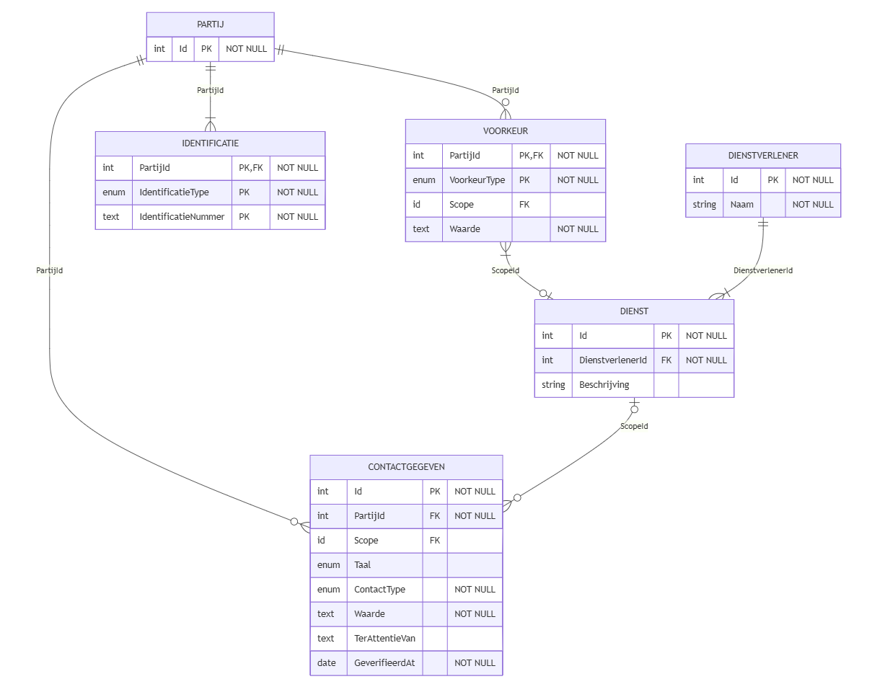
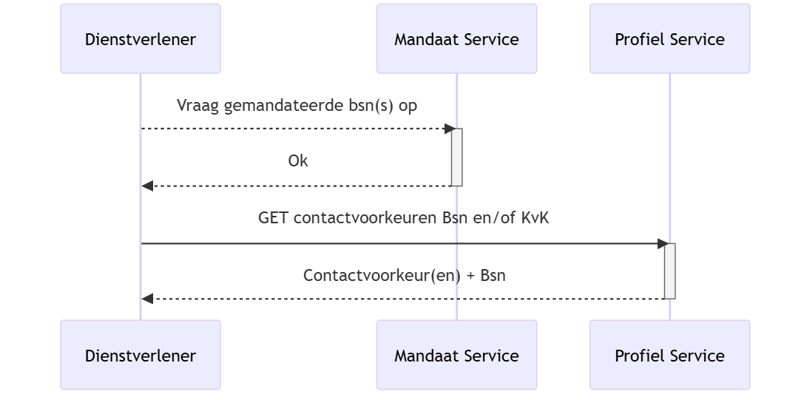

## Data

### Gegevensmodel

Het gegevensmodel van de ProfielService is opgebouwd rond de entiteiten **PARTIJ** en **CONTACTGEGEVEN**.

1. **PARTIJ** is de basis van een natuurlijke persoon of rechtspersoon. Een partij kan één of meerdere identificaties hebben, zoals BSN, KVK, RSIN of andere vormen van identificatie.
2. **CONTACTGEGEVEN** legt vast hoe en via welk kanaal een partij gecontacteerd kan worden door een dienst of organisatie.

Hiermee kunnen burgers en ondernemers vastleggen hoe zij gecontacteerd willen worden, bijvoorbeeld via e-mail of telefoon.

Ter ondersteuning van deze kernfunctionaliteit zijn vier aanvullende entiteiten toegevoegd: **IDENTIFICATIE**, **VOORKEUR**, **DIENSTVERLENER** en **DIENSTVERLENER_AFDELING**.

Hieronder volgt een tabel met de definities die wij hanteren voor deze entiteiten.


#### PARTIJ

| Attribuut  | Omschrijving                    |
|------------|---------------------------------|
| **PARTIJ** |                                 |
| Id         | Unieke identificator van PARTIJ |


#### CONTACTGEGEVEN

| Attribuut          | Omschrijving                                                          |
|--------------------|-----------------------------------------------------------------------|
| **CONTACTGEGEVEN** |                                                                       |
| Id                 | Unieke identificator van contactgegeven                               |
| PartijId           | Identificator van de PARTIJ die eigenaar is van dit contactgegeven    |
| ScopeId            | Verwijzing naar DIENST waarop de scope betrekking heeft               |
| Taal               | De taalvoorkeur voor dit contactgegeven                               |
| ContactType        | Het soort contactgegeven: e-mail of (mobiel) telefoonnummer           |
| Waarde             | De opgegeven contactwaarde (bijv. mailadres)                          |
| TerAttentieVan     | Aanhef die gebruikt kan worden bij het gebruik van dit contactgegeven |
| GeverifieerdAt     | Datum waarop de verificatiestatus voor het laatst is gezet            |

#### IDENTIFICATIE

| Attribuut           | Omschrijving                                                                                       |
|---------------------|----------------------------------------------------------------------------------------------------|
| **DIENSTVERLENER**  |                                                                                                    |
| PartijId            | Identificator van de PARTIJ die eigenaar is van dit CONTACTGEGEVEN                                 |
| IdentificatieType   | Wijze waarop PARTIJ uniek kan worden geïdentificeerd: BSN, KVK, RSIN of ander identificatiesysteem |
| IdentificatieNummer | Nummer waarmee PARTIJ uniek identificeerbaar is binnen het opgegeven IdentificatieType             |

#### VOORKEUR

| Attribuut    | Omschrijving                                                    |
|--------------|-----------------------------------------------------------------|
| **VOORKEUR** |                                                                 |
| PartijId     | Verwijzing naar de PARTIJ waarvoor de voorkeur geldt            |
| VoorkeurType | Het type voorkeur (enum), bijvoorbeeld taal of communicatievorm |
| ScopeId      | Verwijzing naar DIENST waarop de scope betrekking heeft         |
| Waarde       | De waarde van de voorkeur, afhankelijk van het VoorkeurType     |


#### DIENSTVERLENER

| Attribuut          | Omschrijving                            |
|--------------------|-----------------------------------------|
| **DIENSTVERLENER** |                                         |
| Id                 | Unieke identificator van DIENSTVERLENER |
| Naam               | Naam van de dienstverlener              |


#### DIENST

| Attribuut        | Omschrijving                       |
|------------------|------------------------------------|
| **DIENST**       |                                    |
| Id               | Unieke identificator van de dienst |
| DienstverlenerId | Verwijzing naar DIENSTVERLENER     |
| Beschrijving     | Beschrijving van de dienst         |


Het onderstaande diagram geeft de structuur van het gegevensmodel weer, inclusief de relaties tussen PARTIJ, VOORKEUR, CONTACTGEGEVEN, DIENSTVERLENER, en DIENST.



<details>
  <summary>Zie mermaid code</summary>
  
    erDiagram
        PARTIJ {
            int Id PK "NOT NULL"
        }

        CONTACTGEGEVEN {
            int Id PK "NOT NULL"
            int PartijId FK "NOT NULL"
            id Scope FK ""
            enum Taal
            enum ContactType "NOT NULL"
            text Waarde "NOT NULL"
            bool IsGeverifieerd "NOT NULL"
            date GeverifieerdAt "NOT NULL"
        }

        VOORKEUR {
            int PartijId PK,FK "NOT NULL"
            enum VoorkeurType PK "NOT NULL"
            text Waarde "NOT NULL"
        }

        IDENTIFICATIE {
            int PartijId PK,FK "NOT NULL"
            enum IdentificatieType PK "NOT NULL"
            text IdentificatieNummer PK "NOT NULL"
        }

        DIENSTVERLENER {
            int Id PK "NOT NULL"
            string Naam "NOT NULL"
        }

        DIENSTVERLENER_AFDELING {
            int Id PK "NOT NULL"
            int DienstverlenerId FK "NOT NULL"
            string Beschrijving ""
        }

        %% Relationships
        PARTIJ ||--|{ IDENTIFICATIE : "PartijId"
        PARTIJ ||--o{ VOORKEUR : "PartijId"
        PARTIJ ||--o{ CONTACTGEGEVEN : "PartijId"
        DIENSTVERLENER_AFDELING ||--o{ CONTACTGEGEVEN : "ScopeId"
        DIENSTVERLENER ||--|{ DIENSTVERLENER_AFDELING : "DienstverlenerId"

</details>

#### Data Transfer Object (DTO)

Wanneer de profiel-service wordt bevraagd, kan onderstaand DTO als response worden verwacht:

**YAML**

```yaml
id: 1
identifier_type: BSN
identifier_id: "123456789"
contactvoorkeuren:
  - id: 101
    type: EMAIL
    waarde: rvo-afdeling@bedrijf.nl
    scope: ZAKELIJK
    voor_partij_id: 1001
    dienst_type: "0000000123"
    geverifieerd_at: "2025-11-03T12:00:00Z"

  - id: 102
    type: POST
    waarde:
      ter_attentie_van: "Robbert"
      straat: Wilhelminastraat
      huisnummer: 52
      postcode: "2215PA"
      plaats: Den Haag
      land: Nederland
    scope: ZAKELIJK
    voor_partij_id: 1001
    dienst_type: "0000000456"
    geverifieerd_at: "2025-11-03T12:00:00Z"
```

**JSON**

```json
{
  "id": 1,
  "identifier_type": "BSN",
  "identifier_id": "123456789",
  "contactvoorkeuren": [
    {
      "id": 101,
      "type": "EMAIL",
      "waarde": "rvo-afdeling@bedrijf.nl",
      "scope": "ZAKELIJK",
      "voor_partij_id": 1001,
      "dienst_type": "0000000123",
      "geverifieerd_at": "2025-11-03T12:00:00Z"
    },
    {
      "id": 102,
      "type": "POST",
      "waarde": {
        "ter_attentie_van": "Robbert",
        "straat": "Wilhelminastraat",
        "huisnummer": 52,
        "postcode": "2215PA",
        "plaats": "Den Haag",
        "land": "Nederland"
      },
      "scope": "ZAKELIJK",
      "voor_partij_id": 1001,
      "dienst_type": "0000000456",
      "geverifieerd_at": "2025-11-03T12:00:00Z"
    }
  ]
}
```

### Sequentiediagrammen

De volgende diagrammen illustreren de belangrijkste interacties met de ProfielService.

1. Dienstverlener bevraagt de ProfielService  
   In dit scenario vraagt een dienstverlener de contactvoorkeuren op van een ondernemer of onderneming.  
   Deze informatie kan de dienstverlener dan gebruiken om kennisgevingen en/of attenderingen correct af te kunnen leveren.



<details>
  <summary>Zie mermaid code</summary>
  
    sequenceDiagram
        participant Dienstverlener

        Dienstverlener-->>Mandaat Service: Vraag gemandateerde bsn(s) op
        activate Mandaat Service
        Mandaat Service-->>Dienstverlener: Ok
        deactivate Mandaat Service

        participant Profiel as Profiel Service

        Dienstverlener->>Profiel: GET contactvoorkeuren Bsn en/of KvK
        activate Profiel
        Profiel-->>Dienstverlener: Contactvoorkeur(en) + Bsn
        deactivate Profiel

</details>

2. Ondernemer bekijkt en wijzigt contactvoorkeuren  
   Dit scenario toont hoe een ondernemer via het MOZa-portaal zijn eigen contactvoorkeuren kan inzien en aanpassen.  
   Afhankelijk van de loginmethode (bijv. DigiD of eHerkenning) worden de relevante ondernemingen opgehaald, waarna de ondernemer zijn voorkeuren per onderneming kan beheren.  
   Na het aanpassen van een voorkeur wordt deze wijziging via de ProfielService opgeslagen, en indien van toepassing geverifieerd.


<details>
  <summary>Zie mermaid code</summary>
  
    sequenceDiagram
        actor Ondernemer
        participant MOZa as MOZa Portaal
        participant KvK as KvK
        participant Profiel as Profiel Service

        Ondernemer->>MOZa: Logt in
        activate MOZa

        alt Als login via DigiD
            MOZa->>KvK: Haal ondernemingen op voor BSN
            deactivate MOZa
            activate KvK
            KvK-->>MOZa: Geeft ondernemingen terug (KvK-nummers)
            deactivate KvK
            activate MOZa
        end

        MOZa->>Ondernemer: Toon Profiel Pagina
        Ondernemer->>MOZa: Opent pagina 'Contactvoorkeuren'

        MOZa->>Profiel: GET contactvoorkeuren (BSN + KvK)
        deactivate MOZa
        activate Profiel
        Profiel-->>MOZa: Contactvoorkeuren terug
        deactivate Profiel
        activate MOZa

        MOZa->>Ondernemer: Toon pagina 'Contactvoorkeuren'

        Ondernemer->>MOZa: Past contactvoorkeur aan

        MOZa->>Profiel: PATCH contactvoorkeur (BSN + KvK)
        deactivate MOZa
        activate Profiel
        Profiel-->>MOZa: Ok (voorkeur bijgewerkt)
        deactivate Profiel
        activate MOZa

        MOZa-->>Ondernemer: Toont bevestiging
        deactivate MOZa

</details>

Deze scenario’s vormen de basis voor de interacties tussen de ProfielService, dienstverleners en eindgebruikers binnen de keten.
